# Sơ đồ Use Case theo Tác nhân & Sơ đồ hoạt động (PlantUML)

> File này gồm 2 phần, đều dùng cú pháp **PlantUML** (dán vào [plantuml.com/plantuml](http://www.plantuml.com/plantuml) hoặc extension PlantUML trong VSCode để xem trước):
>
> 1. **Sơ đồ use case tách riêng theo từng tác nhân** — thay vì 1 sơ đồ toàn hệ thống to khó nhìn (bản gộp ở `USE_CASE.puml`).
> 2. **Sơ đồ hoạt động (activity diagram) cho từng use case** — chuyển thể từ đặc tả ở `NGHIEP_VU.md` mục 12.
>
> **Toàn bộ sơ đồ dùng lời nói thường** — không dùng tên bảng/cột trong cơ sở dữ liệu, không dùng hàm hay ký hiệu kỹ thuật — để người đọc không cần biết code vẫn hiểu được. Chi tiết kỹ thuật (tên trạng thái, tên bảng, công thức) xem `NGHIEP_VU.md` và `DATABASE.md`.
>
> Mỗi use case chỉ làm đúng 1 việc có mục đích hoàn chỉnh; các nhánh rẽ bên trong (ví dụ chọn cách trả tiền) nằm chung trong 1 sơ đồ, không tách thành use case riêng.

---

## 1. Sơ đồ Use Case theo từng tác nhân

### 1.1. Khách hàng

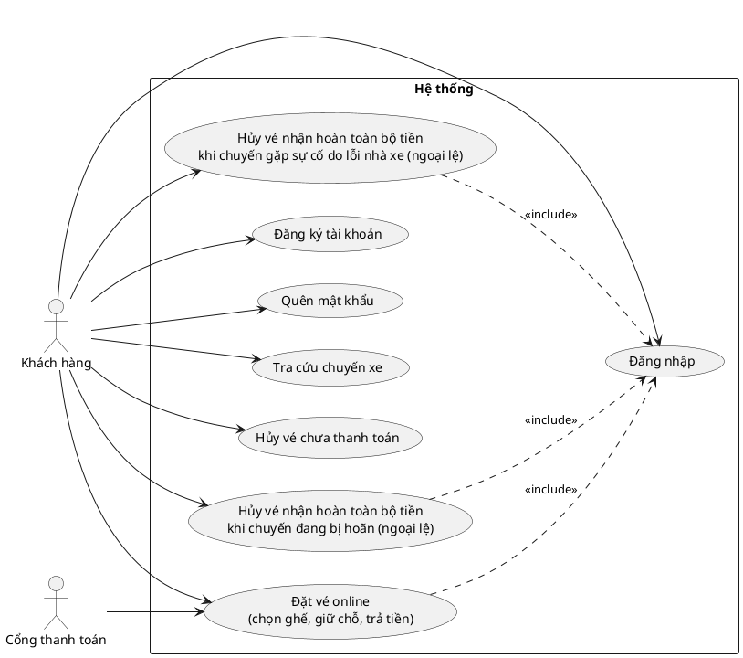

### 1.2. Phụ xe

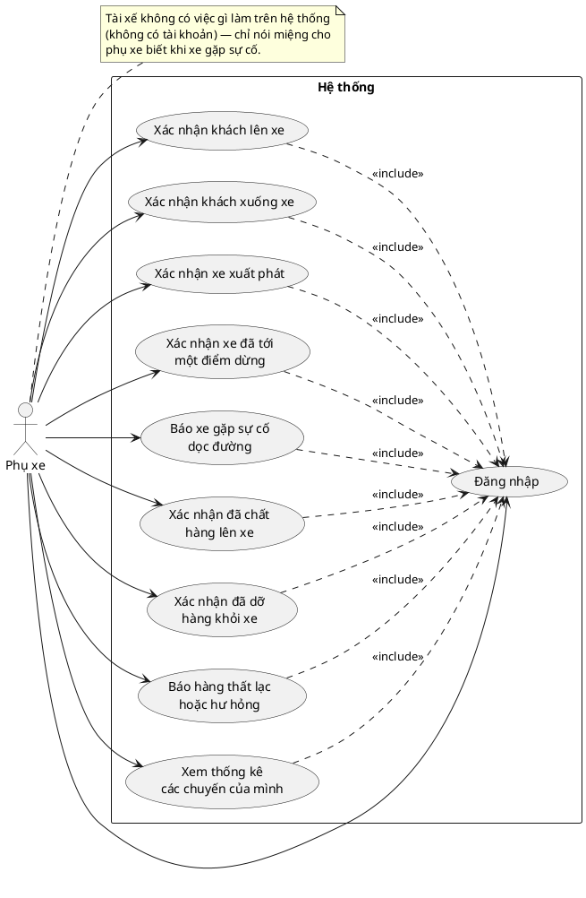

### 1.3. Nhân viên quầy vé

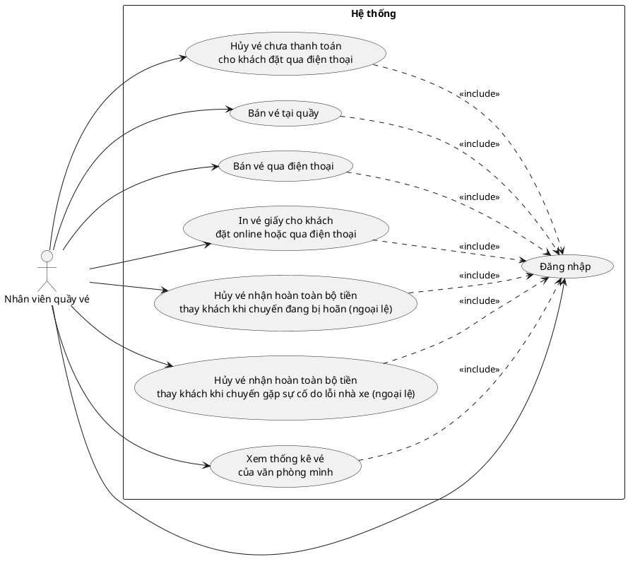

### 1.4. Nhân viên gửi hàng

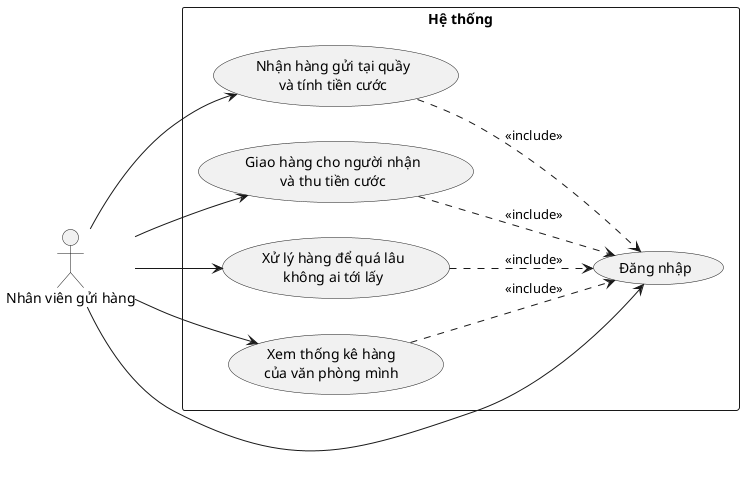

### 1.5. Điều độ viên

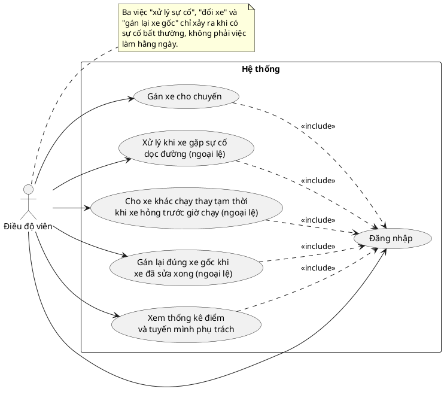

### 1.6. Quản lý

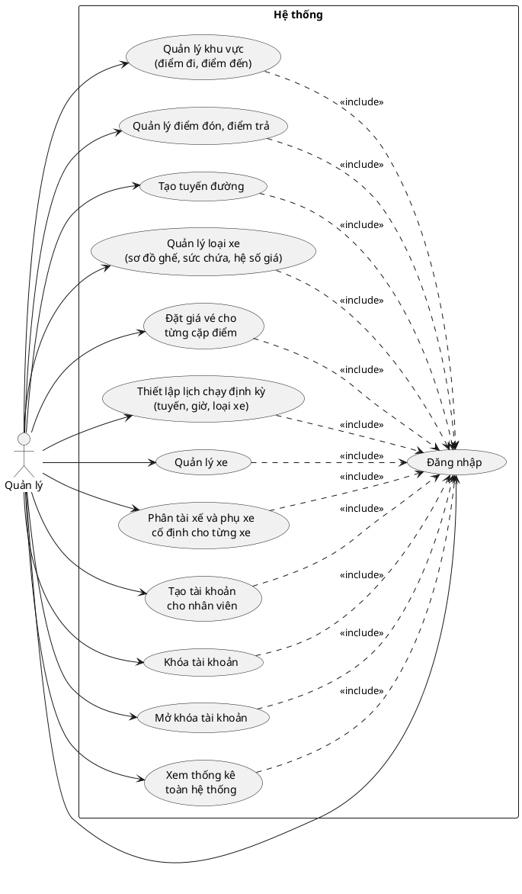

### 1.7. Kế toán

*Chỉ xử lý hoàn tiền cho phần không tự động được qua cổng thanh toán (khách trả tiền mặt) — không gắn văn phòng nào, thấy toàn bộ hệ thống.*

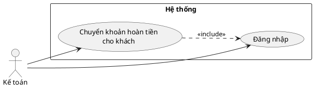

---

## 2. Sơ đồ hoạt động (Activity Diagram) theo use case

### UC-01. Đăng ký tài khoản

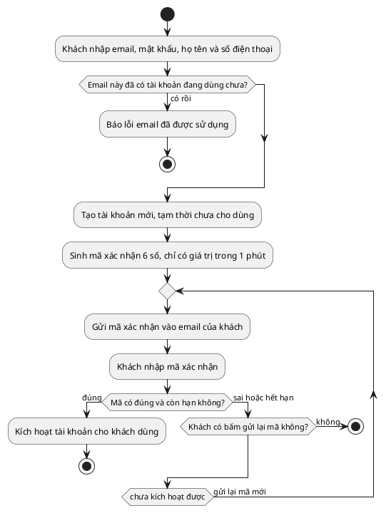

### UC-02. Đăng nhập

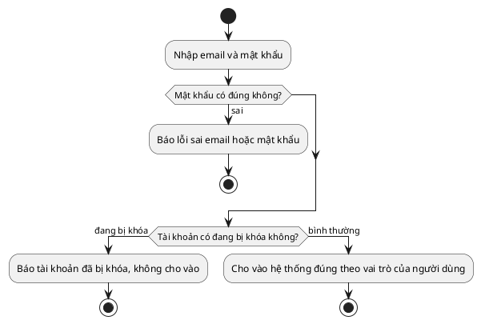

### UC-03. Quên mật khẩu

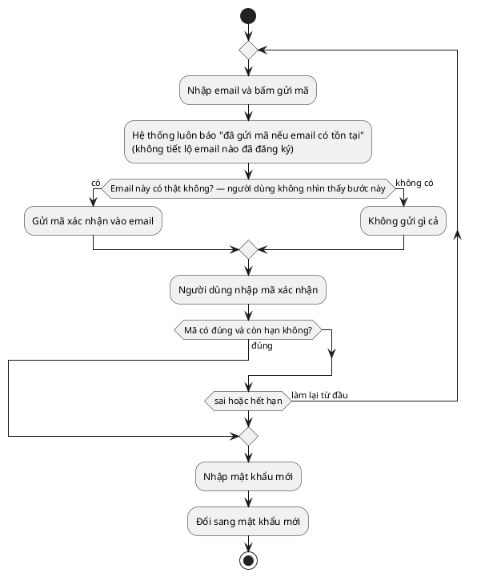

### UC-04. Tra cứu chuyến xe

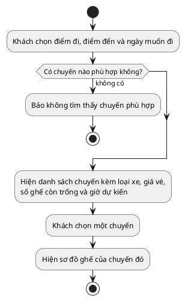

### UC-05. Đặt vé online (chọn ghế, giữ chỗ, trả tiền)

*Một use case duy nhất vì chỉ khi trả tiền xong (hoặc cam kết trả tại quầy) thì khách mới thật sự đặt được vé — dừng ở bước giữ ghế thì chưa có giá trị gì.*

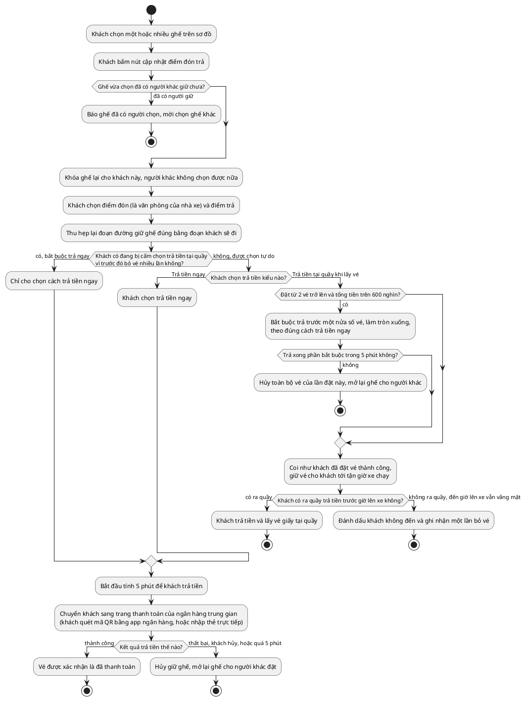

### UC-08. Hủy vé chưa thanh toán

*Vé đã trả tiền rồi thì không hủy được qua use case này — trừ đúng 1 ngoại lệ khi chuyến đang bị hoãn vì hết xe thay thế, xem UC-41.*

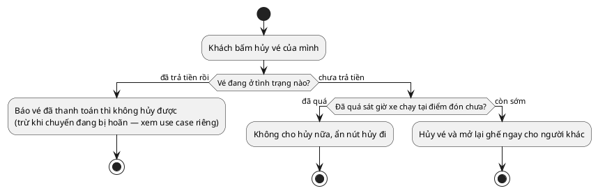

### UC-09. Bán vé tại quầy

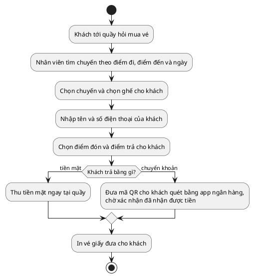

### UC-10. Bán vé qua điện thoại

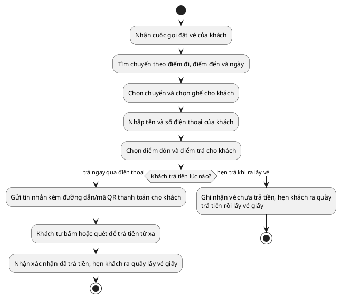

### UC-11. In vé giấy cho khách đặt online hoặc qua điện thoại

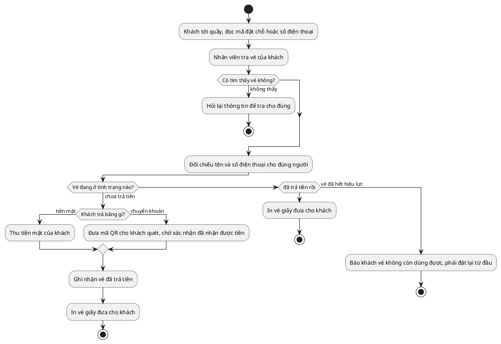

### UC-12. Xác nhận khách lên xe

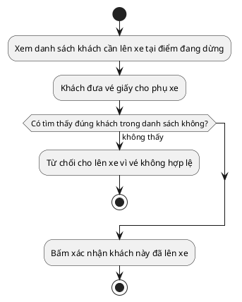

### UC-13. Xác nhận khách xuống xe

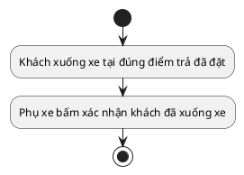

### UC-14. Đánh dấu khách không đến (hệ thống tự chạy theo giờ)

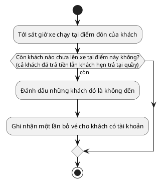

### UC-15. Xác nhận xe xuất phát

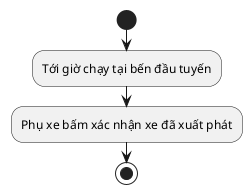

### UC-16. Xác nhận xe đã tới một điểm dừng

```plantuml
@startuml AD_UC16_ToiDiemDung
start
:Xe vừa tới một điểm dừng trên tuyến;
:Phụ xe bấm xác nhận xe đã tới điểm này;
:Hệ thống ghi lại giờ tới thực tế và báo giờ dự kiến mới\ncho khách đang chờ ở các điểm phía sau;
:Mở danh sách khách cần lên và cần xuống tại điểm này;
if (Đây có phải điểm cuối của tuyến không?) then (phải)
  :Chuyến xe kết thúc, coi như đã hoàn thành;
  stop
else (chưa phải)
  :Chờ tới điểm dừng tiếp theo rồi làm lại việc này;
  stop
endif
@enduml
```

### UC-17. Báo xe gặp sự cố dọc đường

```plantuml
@startuml AD_UC17_BaoSuCo
start
:Xe gặp sự cố dọc đường (hỏng xe, tai nạn, tắc đường nặng,\nthiên tai/sạt lở...);
:Tài xế nói cho phụ xe biết tình hình;
:Phụ xe nhập nội dung sự cố lên hệ thống;
:Chọn nguyên nhân: do nhà xe (hỏng xe, thủng lốp, tai nạn\ndo nhà xe gây ra) hay khách quan (thiên tai, sạt lở,\nsự cố ngoại cảnh không do nhà xe);
:Điều độ viên nhận được cảnh báo ngay lập tức;
stop
@enduml
```

### UC-18. Thiết lập lịch chạy định kỳ

*Khách đặt được vé cho chuyến tận nhiều tuần/tháng sau, nhưng biển số xe cụ thể chỉ xuất hiện gần ngày chạy (giống cách các app đặt vé xe khách thật hoạt động) — vì vậy quản lý chỉ cần quyết định tuyến/giờ/loại xe từ trước, còn xe cụ thể do điều độ viên gán sau (xem use case riêng).*

```plantuml
@startuml AD_UC18_LichDinhKy
start
:Chọn một tuyến đã có sẵn;
:Nhập giờ khởi hành trong ngày;
:Chọn loại xe dự kiến phục vụ khung giờ này;
:Lưu lại thành lịch chạy định kỳ;
:Hệ thống tự động sinh sẵn chuyến cho nhiều ngày tới\n(chưa gán xe cụ thể nào) — khách đã có thể tìm và\nđặt vé ngay, dựa theo đúng loại xe đã chọn;
if (Sau này muốn ngừng lịch này thì sao?) then (ngừng áp dụng)
  :Chỉ ngừng sinh chuyến mới —\ncác chuyến đã sinh sẵn (có thể đã bán vé)\nvẫn giữ nguyên, không bị hủy;
endif
stop
@enduml
```

### UC-44. Gán xe cho chuyến

*Điều độ viên chỉ chọn xe — tài xế và phụ xe đi theo xe sẵn rồi, không phải chọn người. Xe chọn phải đúng loại xe đã cam kết khi lập lịch định kỳ (use case trên).*

```plantuml
@startuml AD_UC44_GanXe
start
:Xem danh sách chuyến của văn phòng mình\n(có đánh dấu chuyến sắp chạy mà chưa gán xe);
:Chọn 1 chuyến cần gán xe;
:Hệ thống lọc ra những xe đủ điều kiện\n(đúng loại xe đã cam kết, đang có mặt đúng chỗ,\nkhông trùng lịch);
if (Có xe nào đủ điều kiện không?) then (không có)
  :Báo không còn xe phù hợp,\ngợi ý chờ xe khác rảnh;
  stop
endif
:Chọn một xe cụ thể;
:Gán xe cho chuyến — tài xế và phụ xe lấy luôn\ntheo biên chế cố định của xe đó, biển số\nbắt đầu hiển thị cho khách đã đặt vé;
stop
@enduml
```

### UC-19. Xử lý khi xe gặp sự cố dọc đường (ngoại lệ)

*Nguyên tắc: chuyến không bao giờ bị bỏ dở giữa đường vì lỗi nhà xe — luôn tìm cách hoàn thành dù mất bao lâu. Chỉ sự cố khách quan (thiên tai, sạt lở...) mới có khả năng thực sự không thể hoàn thành. Các mốc thời gian chỉ mang tính hướng dẫn cho điều độ viên đánh giá — không có mốc nào tự động hủy chuyến; riêng mốc "3 tiếng" cho lỗi nhà xe là mốc hệ thống tự động hoàn tiền thật (không phải hủy gì cả), xem use case tự động hoàn tiền quá 3 tiếng. Ngay khi chuyến chuyển sang gặp sự cố, mọi chuyến khác đã lên lịch sẵn cho cùng chiếc xe này đều bị đánh dấu cảnh báo lệch vị trí — điều độ viên xem lại từng chuyến đó sau khi sự cố kết thúc, xem use case "Cho xe khác chạy thay tạm thời" nếu xe không kịp về đúng chỗ.*

```plantuml
@startuml AD_UC19_XuLySuCo
start
:Nhận cảnh báo sự cố;
:Trao đổi với phụ xe/tài xế qua điện thoại để đánh giá\nmức độ và thời gian dự kiến khắc phục;
if (Sự cố do nguyên nhân gì?) then (do nhà xe)
  if (Ước tính khắc phục trong khoảng bao lâu?) then (khoảng 1 tiếng trở lại)
    :Chờ tại chỗ tự khắc phục, không cần điều gì thêm;
    :Cập nhật giờ dự kiến cho khách đang chờ ở các điểm sau;
    :Xong việc, phụ xe xác nhận tiếp tục hành trình;
    :Chuyến chạy tiếp bình thường, không hoàn tiền;
    stop
  else (hơn 1 tiếng hoặc chưa rõ)
    :Tìm xe (hoặc thuê ngoài) tới đúng vị trí xe hỏng\nđể chở tiếp hành khách — luôn tìm được xe,\nkhông có chuyện "hết cách" với lỗi do nhà xe;
    if (Trong lúc chờ, khách đã trả tiền có muốn\nhủy lấy lại tiền không?) then (có, muốn hủy)
      :Khách hủy vé, nhận lại toàn bộ tiền, hết nghĩa vụ chở khách này\n(xem use case hủy vé do lỗi nhà xe giữa đường);
      stop
    else (không, đợi tiếp)
      if (Đã chờ tới mức nào rồi?) then (đạt mốc 3 tiếng mà vẫn chưa xong)
        :Hệ thống tự động hoàn 100% tiền vé cho khách\n(dù khách không yêu cầu) — vé KHÔNG bị hủy,\nvẫn tiếp tục được chở miễn phí khi có xe\n(xem use case tự động hoàn tiền quá 3 tiếng);
      else (chưa tới 3 tiếng)
      endif
    endif
    :Điều được xe thay thế, cập nhật lại vị trí thực tế;
    :Chuyến chạy tiếp bình thường;
    :Đánh dấu cảnh báo cho các chuyến sau của xe hỏng\nđể xem lại thủ công;
    stop
  endif
else (khách quan — thiên tai, sạt lở...)
  if (Ước tính giải quyết trong khoảng bao lâu?) then (khoảng 3 tiếng trở lại, hoặc vẫn còn hi vọng)
    :Chờ tại chỗ — khách KHÔNG có lựa chọn hủy lấy tiền\ndù muốn, vì đây là bất khả kháng;
    :Cập nhật giờ dự kiến cho khách đang chờ ở các điểm sau;
    :Xong việc, phụ xe xác nhận tiếp tục hành trình;
    :Chuyến chạy tiếp bình thường, không hoàn tiền;
    stop
  else (hơn 3 tiếng, và xác nhận thực sự không thể\ntiếp tục được nữa)
    :Hủy phần đường còn lại của chuyến;
    :Chuyến bị hủy giữa đường — chuyển sang\ntự động tính và báo tiền hoàn (100%);
    stop
  endif
endif
@enduml
```

### UC-20. Cho xe khác chạy thay tạm thời khi xe hỏng trước giờ chạy (ngoại lệ)

*Áp dụng cho cả 2 tình huống: xe tự hỏng đột xuất, HOẶC xe không kịp về đúng chỗ vì chuyến ngay trước đó của chính xe này gặp sự cố dọc đường (dù cuối cùng chuyến trước đó tự khắc phục được, delay lâu, hay bị hủy hẳn giữa đường) — bản chất vấn đề như nhau: xe không có mặt đúng nơi đúng giờ. Chỉ đổi "xe đang thực sự lăn bánh" — không đổi xe gốc của chuyến, nên tài xế và phụ xe vẫn là đúng người của xe hỏng, không ai bị xáo trộn lịch làm việc. Chuyến KHÔNG BAO GIỜ bị hủy vì lý do hết xe thay thế — vé là một cam kết chắc chắn với khách, nhất là dịp cao điểm khi khách không còn lựa chọn nào khác nếu bị hủy hẳn; hết xe ngay lúc đó chỉ khiến chuyến bị hoãn giờ chạy.*

```plantuml
@startuml AD_UC20_DoiXe
start
:Tìm xe cùng loại với xe hỏng, đủ điều kiện chạy thay\n(đúng chỗ, còn rảnh) trong đội xe của nhà xe;
if (Có xe nào trong đội xe đủ điều kiện không?) then (không có)
  :Tìm thuê/mượn thêm 1 xe cùng loại\ntừ garage hoặc nhà xe đối tác bên ngoài;
endif
if (Cuối cùng có tìm được xe nào (trong đội xe\nhoặc thuê ngoài) đủ điều kiện không?) then (có)
  :Chọn một xe trong danh sách để chạy thay;
  if (Xe này chỉ sẵn sàng trễ hơn giờ đã lên lịch\nbao lâu?) then (không quá 30 phút — không đáng kể)
    :Xe thay thế chạy hộ chuyến này VÀ toàn bộ\ncác chuyến sắp tới khác của xe hỏng, cho tới khi đổi lại\n(tài xế, phụ xe vẫn giữ nguyên là người của xe hỏng);
    :Giữ nguyên số ghế của từng khách\n(vì cùng loại xe, chắc chắn cùng sơ đồ ghế);
    :Đánh dấu các chuyến này là "đang chạy thay bằng xe khác"\nđể điều độ viên dễ nhận ra;
    :Gửi thông báo đổi xe cho khách đã đặt vé các chuyến này;
    :Điều độ viên tự ghi lại vị trí thực tế của xe hỏng\nkhi biết được, để theo dõi tiến độ sửa chữa;
    stop
  else (trễ hơn 30 phút)
  endif
endif
:Dời lại giờ khởi hành sang thời điểm dự kiến mới,\nđánh dấu chuyến là "đang bị hoãn" — KHÔNG hủy chuyến;
:Thông báo cho khách biết chuyến đang hoãn\nvà giờ dự kiến mới;
:Tiếp tục tìm xe thay thế (quay lại từ đầu) cho tới khi có\n— mục tiêu nội bộ là trong vòng 6 tiếng, quá mốc này\nchỉ báo cho quản lý biết để hỗ trợ thêm, không tự hủy gì cả;
if (Trong lúc chờ, khách đã trả tiền có muốn\nhủy lấy lại tiền thay vì chờ không?) then (có, muốn hủy)
  :Khách hủy vé, nhận lại toàn bộ tiền\n(xem use case "Hủy vé nhận hoàn toàn bộ tiền\nkhi chuyến đang bị hoãn");
else (không, đợi tiếp)
endif
stop
@enduml
```

### UC-21. Tự động tính và báo tiền hoàn (hệ thống tự chạy)

*Chỉ áp dụng cho chuyến bị hủy giữa đường vì sự cố **khách quan** (thiên tai, sạt lở...) thực sự không thể tiếp tục — lỗi do nhà xe không bao giờ dẫn tới hủy chuyến (luôn tìm được xe thay thế). Trường hợp khách tự hủy vé khi chuyến đang gặp sự cố do lỗi nhà xe, hoặc khi chuyến bị hoãn trước giờ chạy, đều do khách chủ động yêu cầu, không qua use case tự động này — xem 2 use case hủy vé nhận hoàn tiền riêng.*

```plantuml
@startuml AD_UC21_TinhTienHoan
start
:Một chuyến bị hủy giữa đường do sự cố khách quan\n(điều độ viên đã xác nhận không thể tiếp tục được nữa);
:Tìm những vé đã trả tiền bị ảnh hưởng;
:Ghi nhận hoàn lại toàn bộ 100% tiền vé\n(không trừ theo phần đường đã đi) và báo cho khách biết;
if (Khách trả tiền bằng chuyển khoản hay tiền mặt lúc đặt vé?) then (chuyển khoản qua cổng)
  :Hoàn tự động qua cổng thanh toán, về đúng\nnơi khách đã trả;
  stop
else (tiền mặt)
  :Đưa vào danh sách chờ kế toán xử lý\n(xem use case kế toán chuyển khoản hoàn tiền);
  stop
endif
@enduml
```

### UC-22. Kế toán chuyển khoản hoàn tiền

*Chỉ xử lý phần không tự động hoàn được qua cổng thanh toán (khách trả tiền mặt, hoặc cổng báo lỗi) — vì tiền mặt không có giao dịch điện tử nào để đảo ngược tự động. Kế toán xem được danh sách chờ xử lý của toàn hệ thống, không giới hạn theo văn phòng.*

```plantuml
@startuml AD_UC22_KeToanHoanTien
start
:Xem danh sách các khoản hoàn tiền đang chờ xử lý\n(toàn hệ thống);
:Chủ động gọi điện cho khách theo đúng số điện thoại\nđã lưu trong hệ thống (không nhận cuộc gọi đến\ntự xưng là khách, tránh bị mạo danh);
if (Liên lạc được khách, và khách cung cấp\nđược tài khoản ngân hàng ngay không?) then (không)
  :Giữ nguyên trong danh sách chờ, thử lại sau;
  stop
endif
:Thực hiện chuyển khoản qua ứng dụng ngân hàng\ncủa công ty (ngoài hệ thống);
:Xác nhận chuyển khoản thành công;
:Nhập lại số tài khoản, tên ngân hàng và tên chủ\ntài khoản vào hệ thống để lưu vết đối soát sau này;
:Đánh dấu đã hoàn tất trên hệ thống, ghi nhận\nngười xử lý và thời điểm;
stop
@enduml
```

### UC-23. Nhận hàng gửi tại quầy và tính tiền cước

```plantuml
@startuml AD_UC23_NhanHangGui
start
:Nhập tên, số điện thoại của người gửi và người nhận;
:Chọn nơi nhận hàng và văn phòng nhận cụ thể;
:Hệ thống liệt kê những chuyến còn nhận hàng đi tới đó;
if (Có chuyến nào còn nhận hàng không?) then (không có)
  :Hẹn khách gửi vào ngày khác;
  stop
endif
:Chọn một chuyến;
:Cân đo hàng và chọn loại hàng;
if (Có phải hàng cấm gửi không?) then (phải)
  :Từ chối nhận hàng;
  stop
endif
if (Khoang hàng của chuyến còn chỗ không?) then (hết chỗ)
  :Gợi ý khách chọn chuyến khác;
  stop
endif
:Nhân viên tự tính và nhập tiền cước, báo giá cho khách;
if (Ai trả tiền cước?) then (người gửi trả trước)
  :Thu tiền cước ngay tại quầy;
else (người nhận trả khi lấy hàng)
  :Chưa thu tiền, để người nhận trả sau;
endif
:Tạo đơn hàng chờ chuyển đi và in biên nhận cho người gửi;
stop
@enduml
```

### UC-24. Giao hàng cho người nhận và thu tiền cước

```plantuml
@startuml AD_UC24_GiaoHang
start
:Nhân viên gọi điện báo người nhận là hàng đã tới;
:Người nhận tới quầy và đọc mã vận đơn;
if (Có tra ra đúng đơn hàng không?) then (không)
  :Hỏi lại thông tin để tra cho đúng;
  stop
endif
if (Tiền cước đã trả chưa?) then (chưa, người nhận trả)
  :Thu tiền cước trước khi giao hàng;
else (người gửi đã trả trước rồi)
  :Giao thẳng, không thu thêm tiền;
endif
:Giao hàng và ghi nhận đã giao xong;
stop
@enduml
```

### UC-25. Xử lý hàng để quá lâu không ai tới lấy

```plantuml
@startuml AD_UC25_HangQuaHan
start
:Hàng nằm ở quầy quá lâu mà không ai tới lấy;
:Đánh dấu đơn hàng này là quá hạn lưu kho;
:Gọi điện liên hệ người gửi;
if (Có liên hệ được người gửi không?) then (được)
  :Xử lý theo ý người gửi (gửi trả lại, hủy, hoặc giữ tiếp);
  stop
else (không liên hệ được)
  :Báo quản lý xử lý thủ công;
  stop
endif
@enduml
```

### UC-26. Xác nhận đã chất hàng lên xe

*Việc bê hàng lên xe là làm tay chân ngoài thực tế — trên hệ thống chỉ bấm xác nhận sau khi đã chất xong.*

```plantuml
@startuml AD_UC26_ChatHang
start
:Hàng đã được chất lên xe xong ngoài thực tế;
:Phụ xe bấm xác nhận đã chất hàng lên xe;
if (Có phát hiện hàng hư hỏng lúc chất không?) then (có)
  :Báo hàng hư hỏng cho nhân viên gửi hàng và quản lý;
endif
stop
@enduml
```

### UC-27. Xác nhận đã dỡ hàng khỏi xe

```plantuml
@startuml AD_UC27_DoHang
start
:Hàng đã được dỡ khỏi xe xong ngoài thực tế;
:Phụ xe bấm xác nhận đã dỡ hàng khỏi xe;
:Hàng chuyển sang trạng thái chờ người nhận tới lấy;
if (Có phát hiện hàng thất lạc hoặc hư hỏng lúc dỡ không?) then (có)
  :Báo cho nhân viên gửi hàng và quản lý;
endif
stop
@enduml
```

### UC-28. Báo hàng thất lạc hoặc hư hỏng

```plantuml
@startuml AD_UC28_BaoThatLac
start
:Phát hiện hàng bị thất lạc hoặc hư hỏng;
:Ghi nhận nội dung báo cáo lên hệ thống;
:Chuyển thông tin cho nhân viên gửi hàng và quản lý xử lý tiếp;
stop
@enduml
```

### UC-29. Quản lý khu vực (điểm đi, điểm đến)

```plantuml
@startuml AD_UC29_QuanLyKhuVuc
start
:Chọn thêm mới hoặc sửa một khu vực;
:Nhập tên khu vực và tỉnh thành;
:Lưu lại;
stop
@enduml
```

### UC-30. Quản lý điểm đón, điểm trả

```plantuml
@startuml AD_UC30_QuanLyDiemDonTra
start
:Chọn thêm mới hoặc sửa một điểm đón trả;
:Chọn khu vực chứa điểm này và nhập địa chỉ cụ thể;
:Chọn đây là văn phòng có quầy vé\nhay chỉ là điểm dừng dọc đường;
:Lưu lại;
stop
@enduml
```

### UC-31. Tạo tuyến đường

```plantuml
@startuml AD_UC31_TaoTuyen
start
:Tạo mới hoặc chọn một nhóm tuyến có sẵn;
:Tạo tuyến mới thuộc nhóm tuyến đó;
repeat
  :Thêm một điểm dừng vào tuyến,\nkèm thứ tự và thời gian dự kiến đi tới điểm đó;
repeat while (Còn điểm dừng nào cần thêm không?) is (còn)
if (Điểm đầu và điểm cuối tuyến có phải văn phòng không?) then (không phải)
  :Báo lỗi và sửa lại danh sách điểm dừng;
  stop
else (đúng là văn phòng)
  :Lưu tuyến lại;
  stop
endif
@enduml
```

### UC-32. Quản lý loại xe

*Mọi xe cùng loại phải giống hệt nhau — cùng sơ đồ ghế, cùng sức chứa khoang hàng, cùng hệ số giá — chỉ khác biển số. Nhờ vậy khi 1 xe hỏng, đổi sang xe khác cùng loại luôn an toàn tuyệt đối, không ai bị ảnh hưởng.*

```plantuml
@startuml AD_UC32_QuanLyLoaiXe
start
:Chọn thêm mới hoặc sửa một loại xe;
:Nhập tên loại xe (ghế ngồi, giường đơn, cabin đôi...);
:Nhập hệ số giá của loại xe đó so với giá gốc;
:Nhập sơ đồ ghế ngồi và sức chứa khoang hàng\náp dụng chung cho mọi xe thuộc loại này;
:Lưu lại;
stop
@enduml
```

### UC-33. Đặt giá vé cho từng cặp điểm

```plantuml
@startuml AD_UC33_DatGiaVe
start
:Chọn một tuyến;
:Chọn cặp điểm đi và điểm đến muốn bán vé;
:Nhập giá gốc cho cặp điểm đó;
:Lưu lại — giá bán thực tế sẽ bằng giá gốc\nnhân với hệ số của loại xe chạy chuyến;
stop
@enduml
```

### UC-34. Quản lý xe

```plantuml
@startuml AD_UC34_QuanLyXe
start
:Chọn thêm mới hoặc sửa một xe;
:Nhập biển số, chọn loại xe, chọn văn phòng gốc của xe,\nchọn tuyến chạy cố định (nếu có);
if (Văn phòng gốc chọn có đúng là văn phòng không?) then (chưa đúng)
  :Báo lỗi và chọn lại;
  stop
endif
:Lưu lại — xe đang sửa chữa thì không cho gán chuyến mới;
if (Vừa chuyển xe từ đang sửa chữa sang đang hoạt động,\nvà xe này đang có chuyến chạy thay bằng xe khác?) then (đúng)
  :Thông báo cho điều độ viên biết xe đã sẵn sàng\n(UC-40, chỉ là nhắc, không tự đổi);
endif
stop
@enduml
```

### UC-35. Phân tài xế và phụ xe cố định cho từng xe

```plantuml
@startuml AD_UC35_PhanNhanSu
start
:Chọn một xe;
:Gán hoặc gỡ tài xế và phụ xe cố định của xe đó;
:Lưu lại — mọi chuyến của xe này sẽ tự dùng đúng người vừa gán,\nkhông cần sửa lại từng chuyến;
stop
@enduml
```

### UC-36. Tạo tài khoản cho nhân viên

```plantuml
@startuml AD_UC36_TaoTaiKhoanNhanVien
start
:Nhập email, chọn vai trò và văn phòng phụ trách cho nhân viên mới;
if (Email này đã có tài khoản chưa?) then (có rồi)
  :Báo lỗi email đã tồn tại;
  stop
endif
:Tạo tài khoản và gửi thư mời qua email;
:Nhân viên bấm liên kết trong thư và tự đặt mật khẩu lần đầu;
:Tài khoản bắt đầu dùng được;
stop
@enduml
```

### UC-37. Khóa tài khoản

```plantuml
@startuml AD_UC37_KhoaTaiKhoan
start
:Tìm tài khoản cần khóa;
:Nhập lý do khóa;
:Khóa tài khoản lại — người này không đăng nhập được nữa,\nnhưng dữ liệu cũ vẫn giữ nguyên;
stop
@enduml
```

### UC-38. Mở khóa tài khoản

```plantuml
@startuml AD_UC38_MoKhoaTaiKhoan
start
:Tìm tài khoản đang bị khóa;
:Xem lại lý do bị khóa trước đó;
:Mở khóa để người này đăng nhập lại được;
stop
@enduml
```

### UC-39. Xem thống kê

```plantuml
@startuml AD_UC39_ThongKe
start
:Chọn khoảng thời gian và loại báo cáo muốn xem;
switch (Người xem là ai?)
case (Phụ xe)
  :Chỉ lấy dữ liệu các chuyến của mình;
case (Nhân viên quầy vé)
  :Chỉ lấy dữ liệu vé của văn phòng mình;
case (Nhân viên gửi hàng)
  :Chỉ lấy dữ liệu hàng của văn phòng mình;
case (Điều độ viên)
  :Chỉ lấy dữ liệu điểm và tuyến mình phụ trách;
case (Quản lý)
  :Lấy dữ liệu toàn hệ thống;
endswitch
:Tính các con số cần xem\n(doanh thu, tỷ lệ lấp đầy ghế, số chuyến hủy hoặc gặp sự cố);
:Hiển thị báo cáo cho người xem;
stop
@enduml
```

### UC-40. Gán lại đúng xe gốc khi xe đã sửa xong (ngoại lệ)

*Việc gán lại hoàn toàn do điều độ viên tự quyết định thời điểm — hệ thống chỉ nhắc, không tự động đổi.*

```plantuml
@startuml AD_UC40_GanLaiXeGoc
start
:Xe hỏng trước đó được sửa xong, chuyển lại trạng thái đang hoạt động;
:Hệ thống thông báo cho điều độ viên biết xe đã sẵn sàng,\nkèm danh sách các chuyến đang chạy thay bằng xe khác;
:Điều độ viên xem lại danh sách và chọn thời điểm phù hợp\n(thường là lúc xe thay thế vừa về đúng chỗ xe gốc đang đỗ);
:Chọn 1 chuyến trong chuỗi để bắt đầu dùng lại xe gốc;
:Từ chuyến đó trở đi, chuyến dùng lại đúng xe gốc,\nbỏ cờ "đang chạy thay";
:Xe thay thế được giải phóng, quay lại làm xe dự phòng\nhoặc lịch trình riêng của nó;
stop
@enduml
```

### UC-41. Hủy vé nhận hoàn toàn bộ tiền khi chuyến đang bị hoãn (ngoại lệ)

*1 trong 3 ngoại lệ duy nhất cho phép hủy 1 vé đã trả tiền — chỉ áp dụng khi chuyến đang trong tình trạng "hoãn" chờ tìm xe thay thế (kết quả nhánh rẽ của use case "Cho xe khác chạy thay tạm thời khi xe hỏng trước giờ chạy"). 2 ngoại lệ còn lại: hủy do lỗi nhà xe giữa đường (use case tiếp theo), và hủy tự động do sự cố khách quan không thể hoàn thành.*

```plantuml
@startuml AD_UC41_HuyVeKhiHoan
start
:Khách xem thông báo chuyến đang bị hoãn\nvà giờ khởi hành dự kiến mới;
:Khách bấm "Hủy vé nhận hoàn tiền";
if (Chuyến này có đang thực sự bị hoãn không?) then (không, đã có xe chạy bình thường rồi)
  :Báo chuyến đã có xe, không thuộc diện\nhủy nhận hoàn tiền nữa;
  stop
endif
:Hủy vé, ghi nhận hoàn toàn bộ 100% tiền vé\n(không hoàn thêm chi phí phát sinh nào khác);
if (Khách trả tiền bằng chuyển khoản qua cổng\nhay tiền mặt lúc đặt vé?) then (chuyển khoản qua cổng)
  :Hoàn tự động qua cổng thanh toán;
  stop
else (tiền mặt)
  :Đưa vào danh sách chờ kế toán xử lý\n(xem use case kế toán chuyển khoản hoàn tiền);
  stop
endif
@enduml
```

### UC-42. Hủy vé nhận hoàn toàn bộ tiền khi chuyến gặp sự cố do lỗi nhà xe giữa đường (ngoại lệ)

*Áp dụng khi chuyến đang gặp sự cố do lỗi nhà xe (xe hỏng, thủng lốp, tai nạn do nhà xe gây ra) và đang chờ xử lý — khác với sự cố khách quan (thiên tai, sạt lở), lúc đó khách không có lựa chọn hủy nào. Khác với use case tự động hoàn tiền quá 3 tiếng (khách vẫn được chở tiếp): ở đây khách chủ động chọn dừng hẳn, nhà xe hết nghĩa vụ chở khách này.*

```plantuml
@startuml AD_UC42_HuyVeSuCoLoiNhaXe
start
:Khách xem thông báo chuyến đang gặp sự cố xe;
:Khách bấm "Hủy vé nhận hoàn tiền";
if (Chuyến này có đang thực sự gặp sự cố do lỗi nhà xe,\nchưa xử lý xong không?) then (không — đã có xe chạy tiếp,\nhoặc sự cố là khách quan)
  :Báo vé không thuộc diện hủy nhận hoàn tiền lúc này;
  stop
endif
:Hủy vé — nhà xe hết nghĩa vụ chở khách này;
if (Vé này đã được tự động hoàn tiền từ trước\n(do chờ quá 3 tiếng) chưa?) then (rồi)
  :Không hoàn thêm gì nữa, chỉ đóng vé lại;
  stop
else (chưa)
  :Ghi nhận hoàn toàn bộ 100% tiền vé;
  if (Khách trả tiền bằng chuyển khoản qua cổng\nhay tiền mặt lúc đặt vé?) then (chuyển khoản qua cổng)
    :Hoàn tự động qua cổng thanh toán;
    stop
  else (tiền mặt)
    :Đưa vào danh sách chờ kế toán xử lý\n(xem use case kế toán chuyển khoản hoàn tiền);
    stop
  endif
endif
@enduml
```

### UC-43. Tự động hoàn tiền khi chờ quá 3 tiếng do lỗi nhà xe (hệ thống tự chạy)

*Khác hẳn các use case hủy vé nhận hoàn tiền khác: vé KHÔNG bị hủy, khách vẫn tiếp tục được chở khi có xe — chỉ là được hoàn tiền trước như một cách nhà xe xin lỗi vì để chờ quá lâu.*

```plantuml
@startuml AD_UC43_TuDongHoanQua3Tieng
start
:Một chuyến đang gặp sự cố do lỗi nhà xe\nđã chờ xử lý quá 3 tiếng mà vẫn chưa xong;
:Tìm những vé đã trả tiền, chưa tự hủy,\nvà chưa từng được hoàn tiền của chuyến này;
:Ghi nhận hoàn toàn bộ 100% tiền vé cho từng vé —\nvé vẫn giữ nguyên, khách vẫn được chở tiếp khi có xe;
:Báo cho khách biết đã được hoàn tiền\nnhưng chuyến vẫn tiếp tục phục vụ miễn phí;
if (Khách trả tiền bằng chuyển khoản qua cổng\nhay tiền mặt lúc đặt vé?) then (chuyển khoản qua cổng)
  :Hoàn tự động qua cổng thanh toán;
  stop
else (tiền mặt)
  :Đưa vào danh sách chờ kế toán xử lý\n(xem use case kế toán chuyển khoản hoàn tiền);
  stop
endif
@enduml
```
