# Sơ đồ Use Case theo Tác nhân & Sơ đồ hoạt động (PlantUML)

> File này gồm 3 phần, đều dùng cú pháp **PlantUML** (dán vào [plantuml.com/plantuml](http://www.plantuml.com/plantuml) hoặc extension PlantUML trong VSCode để xem trước):
>
> 1. **Sơ đồ use case tách riêng theo từng tác nhân** — thay vì 1 sơ đồ toàn hệ thống to khó nhìn (bản gộp ở `USE_CASE.puml`).
> 2. **Sơ đồ hoạt động (activity diagram) cho từng use case** — chuyển thể từ đặc tả ở `NGHIEP_VU.md` mục 12.
> 3. **Sơ đồ lớp (class diagram) mức phân tích** — mục 3 cuối file, 4 sơ đồ theo nhóm nghiệp vụ (khác ERD ở `ERD.dbml`: có kế thừa và phương thức).
>
> **Toàn bộ sơ đồ dùng lời nói thường** — không dùng tên bảng/cột trong cơ sở dữ liệu, không dùng hàm hay ký hiệu kỹ thuật — để người đọc không cần biết code vẫn hiểu được. Chi tiết kỹ thuật (tên trạng thái, tên bảng, công thức) xem `NGHIEP_VU.md` và `DATABASE.md`.
>
> Mỗi use case chỉ làm đúng 1 việc có mục đích hoàn chỉnh; các nhánh rẽ bên trong (ví dụ chọn cách trả tiền) nằm chung trong 1 sơ đồ, không tách thành use case riêng.

---

## 1. Sơ đồ Use Case theo từng tác nhân

### 1.1. Khách hàng

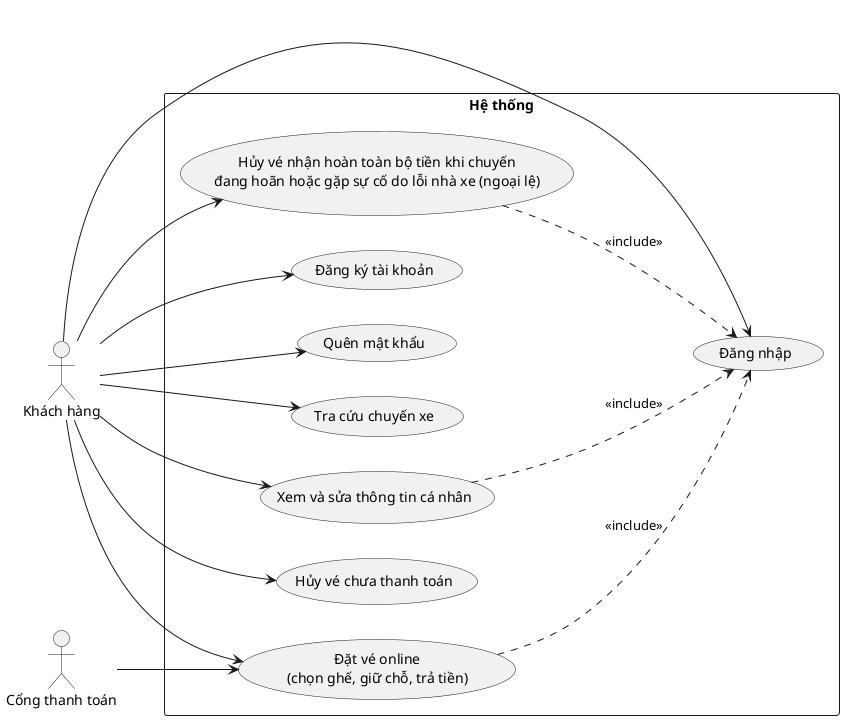
```plantuml
@startuml UseCase_KhachHang
left to right direction
actor "Khách hàng" as KH
actor "Cổng thanh toán" as CTT

rectangle "Hệ thống" {
  usecase "Đăng ký tài khoản" as UC01
  usecase "Đăng nhập" as UC02
  usecase "Quên mật khẩu" as UC03
  usecase "Tra cứu chuyến xe" as UC04
  usecase "Xem và sửa thông tin cá nhân" as UC53
  usecase "Đặt vé online\n(chọn ghế, giữ chỗ, trả tiền)" as UC05
  usecase "Hủy vé chưa thanh toán" as UC08
  usecase "Hủy vé nhận hoàn toàn bộ tiền khi chuyến\nđang hoãn hoặc gặp sự cố do lỗi nhà xe (ngoại lệ)" as UC41
}

KH --> UC01
KH --> UC02
KH --> UC03
KH --> UC04
KH --> UC53
KH --> UC05
KH --> UC08
KH --> UC41

CTT --> UC05

UC05 ..> UC02 : <<include>>
UC41 ..> UC02 : <<include>>
UC53 ..> UC02 : <<include>>
@enduml
```

### 1.2. Phụ xe

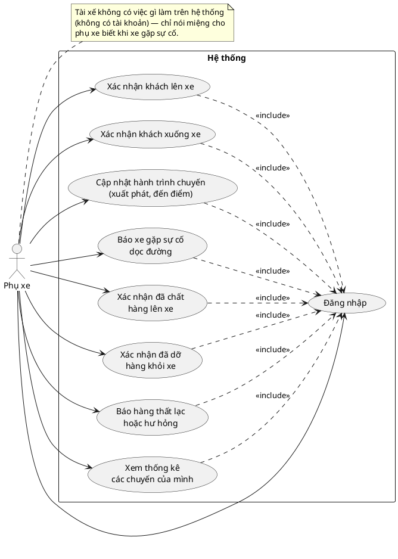
```plantuml
@startuml UseCase_PhuXe
left to right direction
actor "Phụ xe" as PX
note right of PX
  Tài xế không có việc gì làm trên hệ thống
  (không có tài khoản) — chỉ nói miệng cho
  phụ xe biết khi xe gặp sự cố.
end note

rectangle "Hệ thống" {
  usecase "Đăng nhập" as UC02
  usecase "Xác nhận khách lên xe" as UC12
  usecase "Xác nhận khách xuống xe" as UC13
  usecase "Cập nhật hành trình chuyến\n(xuất phát, đến điểm)" as UC15
  usecase "Báo xe gặp sự cố\ndọc đường" as UC17
  usecase "Xác nhận đã chất\nhàng lên xe" as UC26
  usecase "Xác nhận đã dỡ\nhàng khỏi xe" as UC27
  usecase "Báo hàng thất lạc\nhoặc hư hỏng" as UC28
  usecase "Xem thống kê\ncác chuyến của mình" as UC39
}

PX --> UC02
PX --> UC12
PX --> UC13
PX --> UC15
PX --> UC17
PX --> UC26
PX --> UC27
PX --> UC28
PX --> UC39

UC12 ..> UC02 : <<include>>
UC13 ..> UC02 : <<include>>
UC15 ..> UC02 : <<include>>
UC17 ..> UC02 : <<include>>
UC26 ..> UC02 : <<include>>
UC27 ..> UC02 : <<include>>
UC28 ..> UC02 : <<include>>
UC39 ..> UC02 : <<include>>
@enduml
```

### 1.3. Nhân viên quầy vé

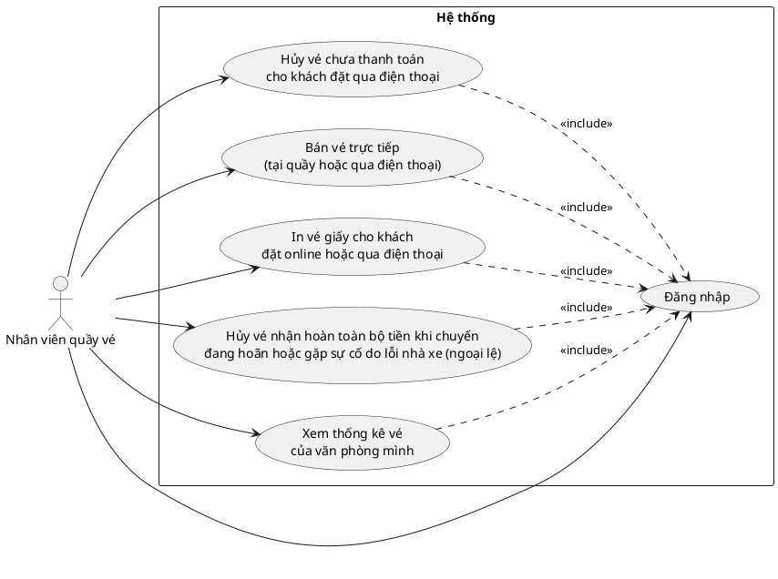
```plantuml
@startuml UseCase_NhanVienQuayVe
left to right direction
actor "Nhân viên quầy vé" as NVQV

rectangle "Hệ thống" {
  usecase "Đăng nhập" as UC02
  usecase "Hủy vé chưa thanh toán\ncho khách đặt qua điện thoại" as UC08
  usecase "Bán vé trực tiếp\n(tại quầy hoặc qua điện thoại)" as UC09
  usecase "In vé giấy cho khách\nđặt online hoặc qua điện thoại" as UC11
  usecase "Hủy vé nhận hoàn toàn bộ tiền khi chuyến\nđang hoãn hoặc gặp sự cố do lỗi nhà xe (ngoại lệ)" as UC41
  usecase "Xem thống kê vé\ncủa văn phòng mình" as UC39
}

NVQV --> UC02
NVQV --> UC08
NVQV --> UC09
NVQV --> UC11
NVQV --> UC41
NVQV --> UC39

UC08 ..> UC02 : <<include>>
UC09 ..> UC02 : <<include>>
UC41 ..> UC02 : <<include>>
UC11 ..> UC02 : <<include>>
UC39 ..> UC02 : <<include>>
@enduml
```

### 1.4. Nhân viên gửi hàng

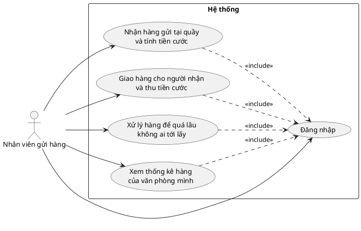
```plantuml
@startuml UseCase_NhanVienGuiHang
left to right direction
actor "Nhân viên gửi hàng" as NVGH

rectangle "Hệ thống" {
  usecase "Đăng nhập" as UC02
  usecase "Nhận hàng gửi tại quầy\nvà tính tiền cước" as UC23
  usecase "Giao hàng cho người nhận\nvà thu tiền cước" as UC24
  usecase "Xử lý hàng để quá lâu\nkhông ai tới lấy" as UC25
  usecase "Xem thống kê hàng\ncủa văn phòng mình" as UC39
}

NVGH --> UC02
NVGH --> UC23
NVGH --> UC24
NVGH --> UC25
NVGH --> UC39

UC23 ..> UC02 : <<include>>
UC24 ..> UC02 : <<include>>
UC25 ..> UC02 : <<include>>
UC39 ..> UC02 : <<include>>
@enduml
```

### 1.5. Điều độ viên

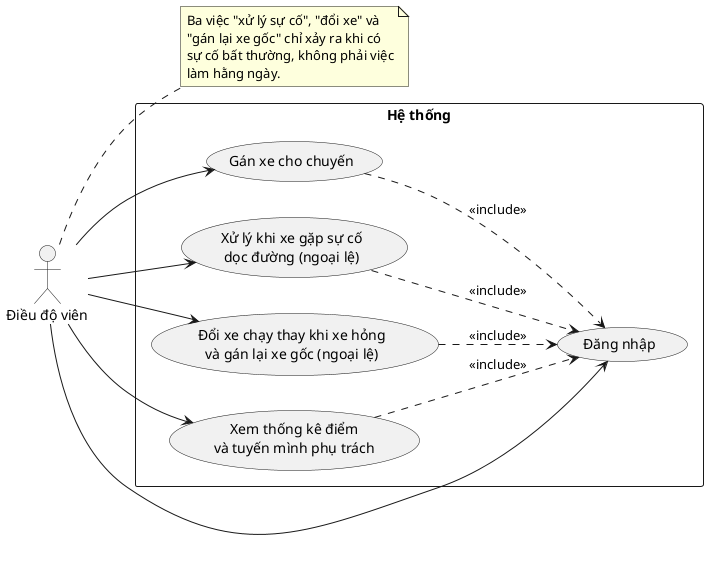
```plantuml
@startuml UseCase_DieuDoVien
left to right direction
actor "Điều độ viên" as DDV
note right of DDV
  Ba việc "xử lý sự cố", "đổi xe" và
  "gán lại xe gốc" chỉ xảy ra khi có
  sự cố bất thường, không phải việc
  làm hằng ngày.
end note

rectangle "Hệ thống" {
  usecase "Gán xe cho chuyến" as UC44
  usecase "Đăng nhập" as UC02
  usecase "Xử lý khi xe gặp sự cố\ndọc đường (ngoại lệ)" as UC19
  usecase "Đổi xe chạy thay khi xe hỏng\nvà gán lại xe gốc (ngoại lệ)" as UC20
  usecase "Xem thống kê điểm\nvà tuyến mình phụ trách" as UC39
}

DDV --> UC02
DDV --> UC44
DDV --> UC19
DDV --> UC20
DDV --> UC39

UC44 ..> UC02 : <<include>>
UC19 ..> UC02 : <<include>>
UC20 ..> UC02 : <<include>>
UC39 ..> UC02 : <<include>>
@enduml
```

### 1.6. Quản lý

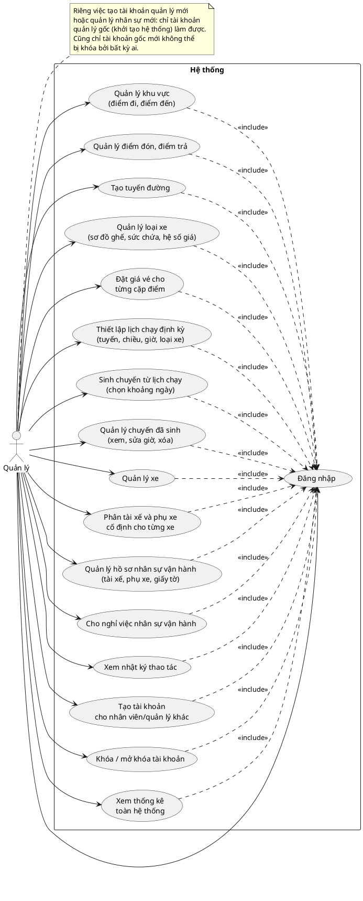
```plantuml
@startuml UseCase_QuanLy
left to right direction
actor "Quản lý" as QL
note right of QL
  Riêng việc tạo tài khoản quản lý mới
  hoặc quản lý nhân sự mới: chỉ tài khoản
  quản lý gốc (khởi tạo hệ thống) làm được.
  Cũng chỉ tài khoản gốc mới không thể
  bị khóa bởi bất kỳ ai.
end note

rectangle "Hệ thống" {
  usecase "Đăng nhập" as UC02
  usecase "Quản lý khu vực\n(điểm đi, điểm đến)" as UC29
  usecase "Quản lý điểm đón, điểm trả" as UC30
  usecase "Tạo tuyến đường" as UC31
  usecase "Quản lý loại xe\n(sơ đồ ghế, sức chứa, hệ số giá)" as UC32
  usecase "Đặt giá vé cho\ntừng cặp điểm" as UC33
  usecase "Thiết lập lịch chạy định kỳ\n(tuyến, chiều, giờ, loại xe)" as UC18
  usecase "Sinh chuyến từ lịch chạy\n(chọn khoảng ngày)" as UC47
  usecase "Quản lý chuyến đã sinh\n(xem, sửa giờ, xóa)" as UC48
  usecase "Quản lý xe" as UC34
  usecase "Phân tài xế và phụ xe\ncố định cho từng xe" as UC35
  usecase "Quản lý hồ sơ nhân sự vận hành\n(tài xế, phụ xe, giấy tờ)" as UC49
  usecase "Cho nghỉ việc nhân sự vận hành" as UC51
  usecase "Xem nhật ký thao tác" as UC52
  usecase "Tạo tài khoản\ncho nhân viên/quản lý khác" as UC36
  usecase "Khóa / mở khóa tài khoản" as UC37
  usecase "Xem thống kê\ntoàn hệ thống" as UC39
}

QL --> UC02
QL --> UC29
QL --> UC30
QL --> UC31
QL --> UC32
QL --> UC33
QL --> UC18
QL --> UC47
QL --> UC48
QL --> UC34
QL --> UC35
QL --> UC49
QL --> UC51
QL --> UC52
QL --> UC36
QL --> UC37
QL --> UC39

UC29 ..> UC02 : <<include>>
UC30 ..> UC02 : <<include>>
UC31 ..> UC02 : <<include>>
UC32 ..> UC02 : <<include>>
UC33 ..> UC02 : <<include>>
UC18 ..> UC02 : <<include>>
UC47 ..> UC02 : <<include>>
UC48 ..> UC02 : <<include>>
UC34 ..> UC02 : <<include>>
UC35 ..> UC02 : <<include>>
UC49 ..> UC02 : <<include>>
UC51 ..> UC02 : <<include>>
UC52 ..> UC02 : <<include>>
UC36 ..> UC02 : <<include>>
UC37 ..> UC02 : <<include>>
UC39 ..> UC02 : <<include>>
@enduml
```

### 1.7. Kế toán

*Chỉ xử lý hoàn tiền cho phần không tự động được qua cổng thanh toán (khách trả tiền mặt) — không gắn văn phòng nào, thấy toàn bộ hệ thống.*

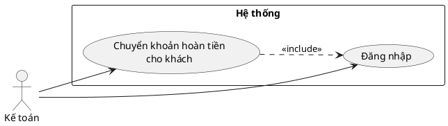
```plantuml
@startuml UseCase_KeToan
left to right direction
actor "Kế toán" as KT

rectangle "Hệ thống" {
  usecase "Đăng nhập" as UC02
  usecase "Chuyển khoản hoàn tiền\ncho khách" as UC22
}

KT --> UC02
KT --> UC22

UC22 ..> UC02 : <<include>>
@enduml
```

### 1.8. Quản lý nhân sự

*Tạo/khóa/mở khóa tài khoản và quản lý hồ sơ (kèm giấy tờ) của nhân viên vận hành; không đụng tới tài khoản kế toán hay quản lý, không có quyền nghiệp vụ nào khác. Hệ thống tự nhắc khi giấy tờ sắp hết hạn.*

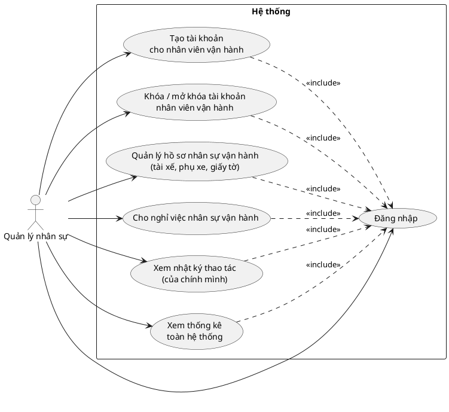
```plantuml
@startuml UseCase_QuanLyNhanSu
left to right direction
actor "Quản lý nhân sự" as QLNS

rectangle "Hệ thống" {
  usecase "Đăng nhập" as UC02
  usecase "Tạo tài khoản\ncho nhân viên vận hành" as UC36
  usecase "Khóa / mở khóa tài khoản\nnhân viên vận hành" as UC37
  usecase "Quản lý hồ sơ nhân sự vận hành\n(tài xế, phụ xe, giấy tờ)" as UC49
  usecase "Cho nghỉ việc nhân sự vận hành" as UC51
  usecase "Xem nhật ký thao tác\n(của chính mình)" as UC52
  usecase "Xem thống kê\ntoàn hệ thống" as UC39
}

QLNS --> UC02
QLNS --> UC36
QLNS --> UC37
QLNS --> UC49
QLNS --> UC51
QLNS --> UC52
QLNS --> UC39

UC36 ..> UC02 : <<include>>
UC37 ..> UC02 : <<include>>
UC49 ..> UC02 : <<include>>
UC51 ..> UC02 : <<include>>
UC52 ..> UC02 : <<include>>
UC39 ..> UC02 : <<include>>
@enduml
```

---

## 2. Sơ đồ hoạt động (Activity Diagram) theo use case

### UC-01. Đăng ký tài khoản

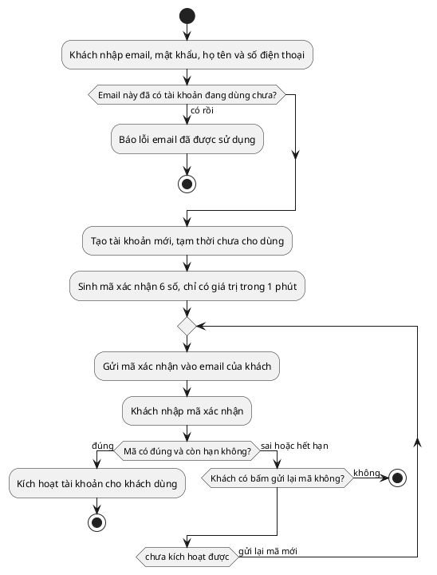
```plantuml
@startuml AD_UC01_DangKy
start
:Khách nhập email, mật khẩu, họ tên và số điện thoại;
if (Email này đã có tài khoản đang dùng chưa?) then (có rồi)
  :Báo lỗi email đã được sử dụng;
  stop
endif
:Tạo tài khoản mới, tạm thời chưa cho dùng;
:Sinh mã xác nhận 6 số, chỉ có giá trị trong 1 phút;
repeat
  :Gửi mã xác nhận vào email của khách;
  :Khách nhập mã xác nhận;
  if (Mã có đúng và còn hạn không?) then (đúng)
    :Kích hoạt tài khoản cho khách dùng;
    stop
  else (sai hoặc hết hạn)
    if (Khách có bấm gửi lại mã không?) then (không)
      stop
    endif
  endif
repeat while (chưa kích hoạt được) is (gửi lại mã mới)
@enduml
```

### UC-02. Đăng nhập

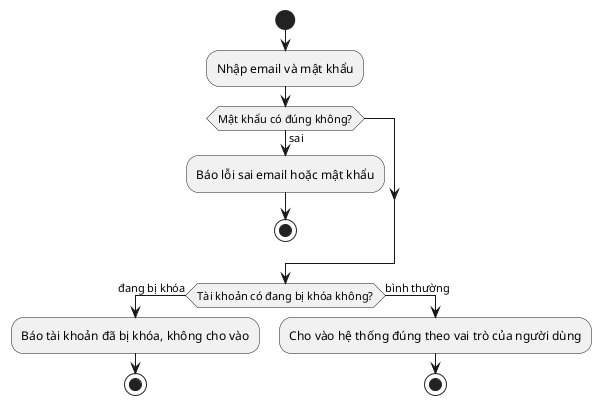
```plantuml
@startuml AD_UC02_DangNhap
start
:Nhập email và mật khẩu;
if (Mật khẩu có đúng không?) then (sai)
  :Báo lỗi sai email hoặc mật khẩu;
  stop
endif
if (Tài khoản có đang bị khóa không?) then (đang bị khóa)
  :Báo tài khoản đã bị khóa, không cho vào;
  stop
else (bình thường)
  :Cho vào hệ thống đúng theo vai trò của người dùng;
  stop
endif
@enduml
```

### UC-03. Quên mật khẩu

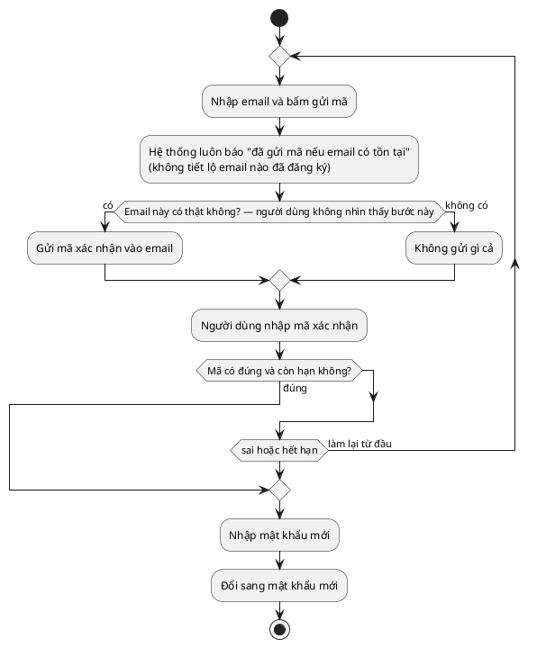
```plantuml
@startuml AD_UC03_QuenMatKhau
start
repeat
  :Nhập email và bấm gửi mã;
  :Hệ thống luôn báo "đã gửi mã nếu email có tồn tại"\n(không tiết lộ email nào đã đăng ký);
  if (Email này có thật không? — người dùng không nhìn thấy bước này) then (có)
    :Gửi mã xác nhận vào email;
  else (không có)
    :Không gửi gì cả;
  endif
  :Người dùng nhập mã xác nhận;
  if (Mã có đúng và còn hạn không?) then (đúng)
    break
  endif
repeat while (sai hoặc hết hạn) is (làm lại từ đầu)
:Nhập mật khẩu mới;
:Đổi sang mật khẩu mới;
stop
@enduml
```

### UC-04. Tra cứu chuyến xe

*Không cần đăng nhập — đây là trang chủ của hệ thống.*

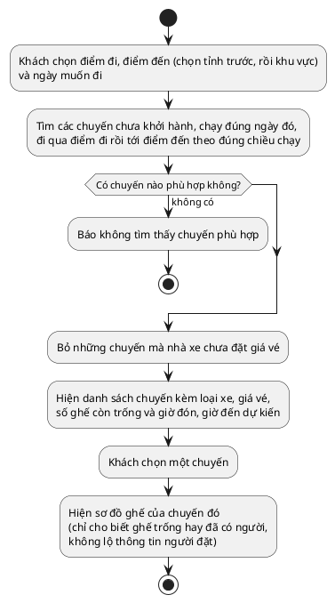
```plantuml
@startuml AD_UC04_TraCuu
start
:Khách chọn điểm đi, điểm đến (chọn tỉnh trước, rồi khu vực)\nvà ngày muốn đi;
:Tìm các chuyến chưa khởi hành, chạy đúng ngày đó,\nđi qua điểm đi rồi tới điểm đến theo đúng chiều chạy;
if (Có chuyến nào phù hợp không?) then (không có)
  :Báo không tìm thấy chuyến phù hợp;
  stop
endif
:Bỏ những chuyến mà nhà xe chưa đặt giá vé;
:Hiện danh sách chuyến kèm loại xe, giá vé,\nsố ghế còn trống và giờ đón, giờ đến dự kiến;
:Khách chọn một chuyến;
:Hiện sơ đồ ghế của chuyến đó\n(chỉ cho biết ghế trống hay đã có người,\nkhông lộ thông tin người đặt);
stop
@enduml
```

### UC-05. Đặt vé online (chọn ghế, giữ chỗ, trả tiền)

*Một use case duy nhất vì chỉ khi trả tiền xong (hoặc cam kết trả tại quầy) thì khách mới thật sự đặt được vé — dừng ở bước giữ ghế thì chưa có giá trị gì.*

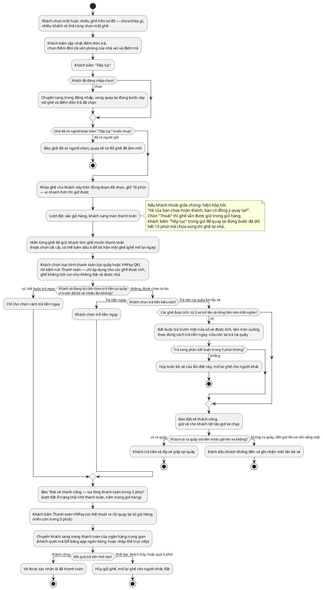
```plantuml
@startuml AD_UC05_DatVeOnline
start
:Khách chọn một hoặc nhiều ghế trên sơ đồ — chưa khóa gì,\nnhiều khách có thể cùng chọn một ghế;
:Khách bấm cập nhật điểm đón trả,\nchọn điểm đón (là văn phòng của nhà xe) và điểm trả;
:Khách bấm "Tiếp tục";
if (Khách đã đăng nhập chưa?) then (chưa)
  :Chuyển sang trang đăng nhập, xong quay lại đúng bước này\nvới ghế và điểm đón trả đã chọn;
endif
if (Ghế đã có người khác bấm "Tiếp tục" trước chưa?) then (đã có người giữ)
  :Báo ghế đã có người chọn, quay về sơ đồ ghế đã làm mới;
  stop
endif
:Khóa ghế cho khách này trên đúng đoạn đã chọn, giữ 10 phút\n— ai nhanh hơn thì giữ được;
:Lượt đặt vào giỏ hàng, khách sang màn thanh toán;
note right
  Nếu khách thoát giữa chừng: hiện hộp hỏi
  "Vé của bạn chưa hoàn thành, bạn có đồng ý quay lại?".
  Chọn "Thoát" thì ghế vẫn được giữ trong giỏ hàng,
  khách bấm "Tiếp tục" trong giỏ để quay lại đúng bước đã dở;
  hết 10 phút mà chưa xong thì ghế tự nhả.
end note
:Hiện từng ghế đã giữ; khách tích ghế muốn thanh toán\n(hoặc chọn tất cả), có thể bấm dấu X để bỏ hẳn một ghế (ghế mở lại ngay);
:Khách chọn loại hình thanh toán (tại quầy hoặc VNPay QR)\nrồi bấm nút Thanh toán — chỉ áp dụng cho các ghế được tích,\nghế không tích coi như không đặt và được nhả;
if (Khách có đang bị cấm chọn trả tiền tại quầy\nvì trước đó bỏ vé nhiều lần không?) then (có, bắt buộc trả ngay)
  :Chỉ cho chọn cách trả tiền ngay;
else (không, được chọn tự do)
  if (Khách chọn trả tiền kiểu nào?) then (Trả tiền ngay)
    :Khách chọn trả tiền ngay;
  else (Trả tiền tại quầy khi lấy vé)
    if (Các ghế được tích: từ 2 vé trở lên và tổng tiền trên 600 nghìn?) then (có)
      :Bắt buộc trả trước một nửa số vé được tích, làm tròn xuống,\ntheo đúng cách trả tiền ngay; nửa còn lại trả tại quầy;
      if (Trả xong phần bắt buộc trong 5 phút không?) then (không)
        :Hủy toàn bộ vé của lần đặt này, mở lại ghế cho người khác;
        stop
      endif
    endif
    :Báo đặt vé thành công,\ngiữ vé cho khách tới tận giờ xe chạy;
    if (Khách có ra quầy trả tiền trước giờ lên xe không?) then (có ra quầy)
      :Khách trả tiền và lấy vé giấy tại quầy;
      stop
    else (không ra quầy, đến giờ lên xe vẫn vắng mặt)
      :Đánh dấu khách không đến và ghi nhận một lần bỏ vé;
      stop
    endif
  endif
endif
:Báo "Đặt vé thành công — vui lòng thanh toán trong 5 phút"\n(lượt đặt ở trạng thái chờ thanh toán, nằm trong giỏ hàng);
:Khách bấm Thanh toán VNPay (có thể thoát ra rồi quay lại từ giỏ hàng,\nmiễn còn trong 5 phút);
:Chuyển khách sang trang thanh toán của ngân hàng trung gian\n(khách quét mã QR bằng app ngân hàng, hoặc nhập thẻ trực tiếp);
if (Kết quả trả tiền thế nào?) then (thành công)
  :Vé được xác nhận là đã thanh toán;
  stop
else (thất bại, khách hủy, hoặc quá 5 phút)
  :Hủy giữ ghế, mở lại ghế cho người khác đặt;
  stop
endif
@enduml
```

### UC-08. Hủy vé chưa thanh toán

*Vé đã trả tiền rồi thì không hủy được qua use case này — trừ đúng 1 ngoại lệ khi chuyến đang bị hoãn vì hết xe thay thế, xem UC-41.*

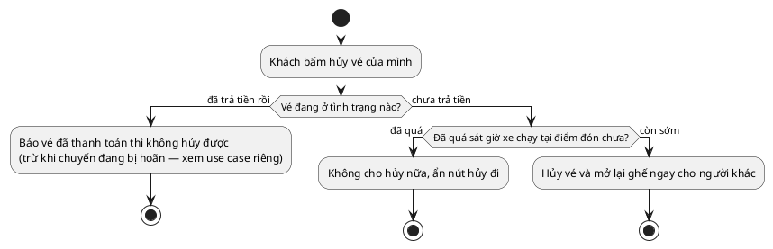
```plantuml
@startuml AD_UC08_HuyVe
start
:Khách bấm hủy vé của mình;
if (Vé đang ở tình trạng nào?) then (đã trả tiền rồi)
  :Báo vé đã thanh toán thì không hủy được\n(trừ khi chuyến đang bị hoãn — xem use case riêng);
  stop
else (chưa trả tiền)
  if (Đã quá sát giờ xe chạy tại điểm đón chưa?) then (đã quá)
    :Không cho hủy nữa, ẩn nút hủy đi;
    stop
  else (còn sớm)
    :Hủy vé và mở lại ghế ngay cho người khác;
    stop
  endif
endif
@enduml
```

### UC-09. Bán vé trực tiếp cho khách (tại quầy hoặc qua điện thoại) *(gộp từ UC-09 + UC-10 cũ)*

*Nhân viên quầy vé bán vé cho khách đến trực tiếp hoặc gọi điện — cùng một mục tiêu, chỉ khác cách khách trả tiền và nhận vé.*

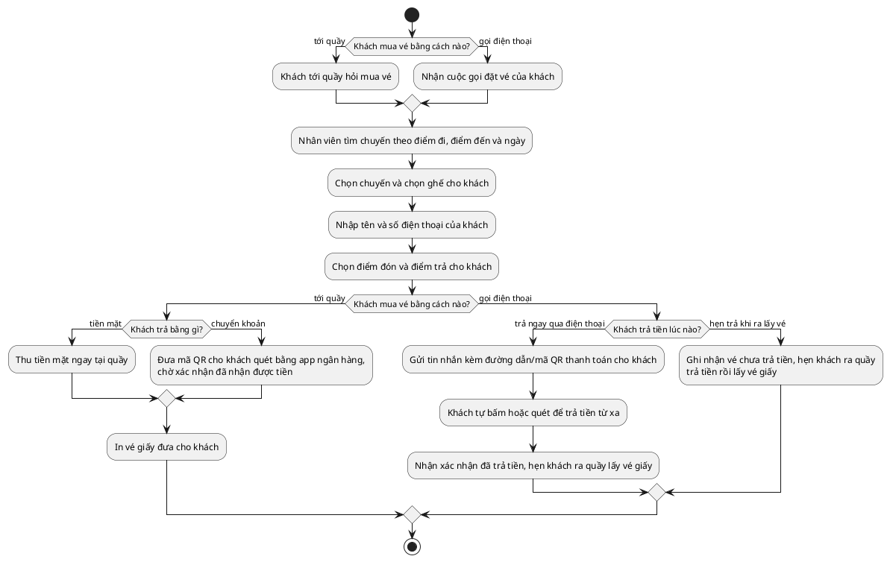
```plantuml
@startuml AD_UC09_BanVeTrucTiep
start
if (Khách mua vé bằng cách nào?) then (tới quầy)
  :Khách tới quầy hỏi mua vé;
else (gọi điện thoại)
  :Nhận cuộc gọi đặt vé của khách;
endif
:Nhân viên tìm chuyến theo điểm đi, điểm đến và ngày;
:Chọn chuyến và chọn ghế cho khách;
:Nhập tên và số điện thoại của khách;
:Chọn điểm đón và điểm trả cho khách;
if (Khách mua vé bằng cách nào?) then (tới quầy)
  if (Khách trả bằng gì?) then (tiền mặt)
    :Thu tiền mặt ngay tại quầy;
  else (chuyển khoản)
    :Đưa mã QR cho khách quét bằng app ngân hàng,\nchờ xác nhận đã nhận được tiền;
  endif
  :In vé giấy đưa cho khách;
else (gọi điện thoại)
  if (Khách trả tiền lúc nào?) then (trả ngay qua điện thoại)
    :Gửi tin nhắn kèm đường dẫn/mã QR thanh toán cho khách;
    :Khách tự bấm hoặc quét để trả tiền từ xa;
    :Nhận xác nhận đã trả tiền, hẹn khách ra quầy lấy vé giấy;
  else (hẹn trả khi ra lấy vé)
    :Ghi nhận vé chưa trả tiền, hẹn khách ra quầy\ntrả tiền rồi lấy vé giấy;
  endif
endif
stop
@enduml
```

### UC-11. In vé giấy cho khách đặt online hoặc qua điện thoại

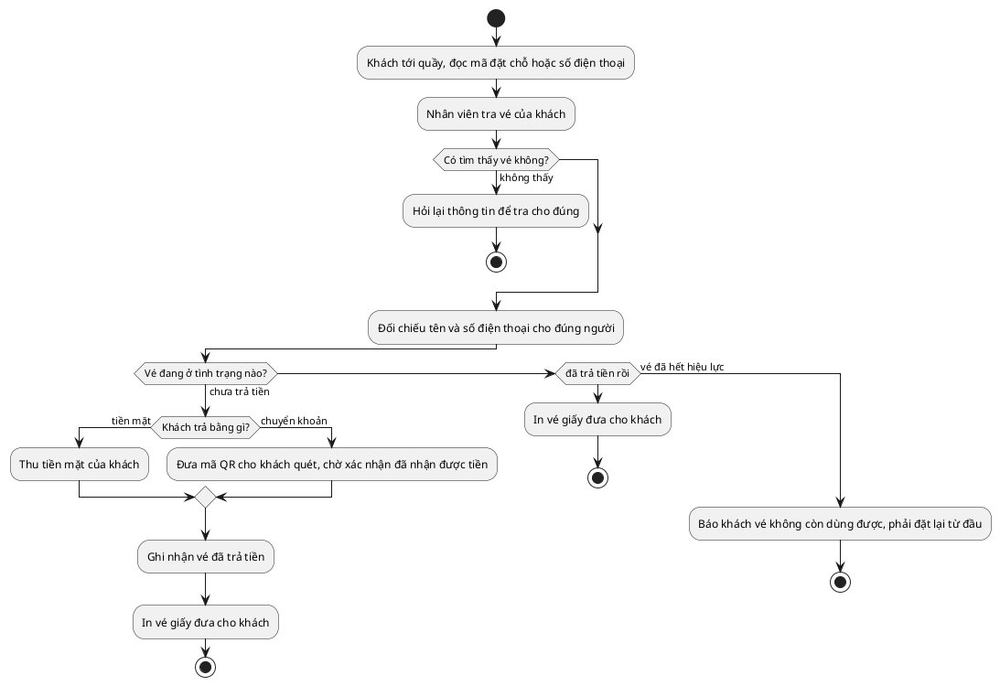
```plantuml
@startuml AD_UC11_InVeGiay
start
:Khách tới quầy, đọc mã đặt chỗ hoặc số điện thoại;
:Nhân viên tra vé của khách;
if (Có tìm thấy vé không?) then (không thấy)
  :Hỏi lại thông tin để tra cho đúng;
  stop
endif
:Đối chiếu tên và số điện thoại cho đúng người;
if (Vé đang ở tình trạng nào?) then (chưa trả tiền)
  if (Khách trả bằng gì?) then (tiền mặt)
    :Thu tiền mặt của khách;
  else (chuyển khoản)
    :Đưa mã QR cho khách quét, chờ xác nhận đã nhận được tiền;
  endif
  :Ghi nhận vé đã trả tiền;
  :In vé giấy đưa cho khách;
  stop
elseif (đã trả tiền rồi) then
  :In vé giấy đưa cho khách;
  stop
else (vé đã hết hiệu lực)
  :Báo khách vé không còn dùng được, phải đặt lại từ đầu;
  stop
endif
@enduml
```

### UC-12. Xác nhận khách lên xe *(gồm cơ chế UC-14 cũ)*

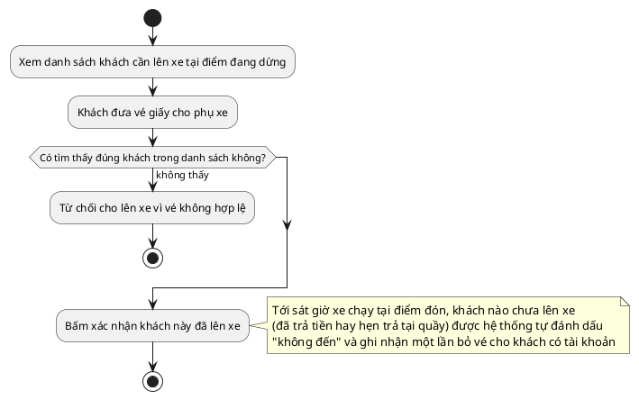
```plantuml
@startuml AD_UC12_LenXe
start
:Xem danh sách khách cần lên xe tại điểm đang dừng;
:Khách đưa vé giấy cho phụ xe;
if (Có tìm thấy đúng khách trong danh sách không?) then (không thấy)
  :Từ chối cho lên xe vì vé không hợp lệ;
  stop
endif
:Bấm xác nhận khách này đã lên xe;
note right
  Tới sát giờ xe chạy tại điểm đón, khách nào chưa lên xe
  (đã trả tiền hay hẹn trả tại quầy) được hệ thống tự đánh dấu
  "không đến" và ghi nhận một lần bỏ vé cho khách có tài khoản
end note
stop
@enduml
```

### UC-13. Xác nhận khách xuống xe

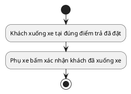
```plantuml
@startuml AD_UC13_XuongXe
start
:Khách xuống xe tại đúng điểm trả đã đặt;
:Phụ xe bấm xác nhận khách đã xuống xe;
stop
@enduml
```

### UC-15. Cập nhật hành trình chuyến (xuất phát, đến điểm) *(gộp từ UC-15 + UC-16 cũ)*

*Phụ xe báo mốc chạy của chuyến: xuất phát ở bến đầu tuyến, rồi mỗi lần xe tới một điểm dừng.*

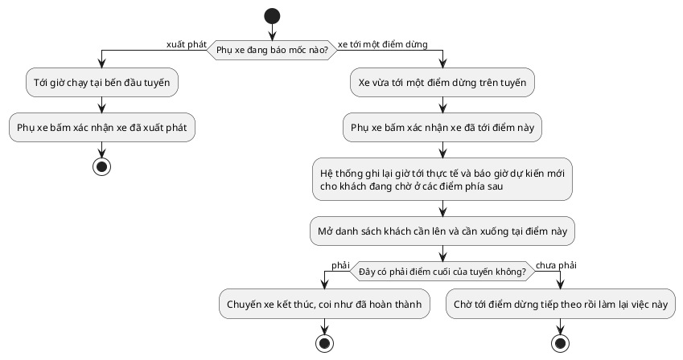
```plantuml
@startuml AD_UC15_HanhTrinh
start
if (Phụ xe đang báo mốc nào?) then (xuất phát)
  :Tới giờ chạy tại bến đầu tuyến;
  :Phụ xe bấm xác nhận xe đã xuất phát;
  stop
else (xe tới một điểm dừng)
  :Xe vừa tới một điểm dừng trên tuyến;
  :Phụ xe bấm xác nhận xe đã tới điểm này;
  :Hệ thống ghi lại giờ tới thực tế và báo giờ dự kiến mới\ncho khách đang chờ ở các điểm phía sau;
  :Mở danh sách khách cần lên và cần xuống tại điểm này;
  if (Đây có phải điểm cuối của tuyến không?) then (phải)
    :Chuyến xe kết thúc, coi như đã hoàn thành;
    stop
  else (chưa phải)
    :Chờ tới điểm dừng tiếp theo rồi làm lại việc này;
    stop
  endif
endif
@enduml
```

### UC-17. Báo xe gặp sự cố dọc đường

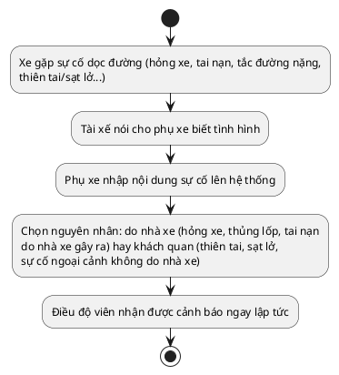
```plantuml
@startuml AD_UC17_BaoSuCo
start
:Xe gặp sự cố dọc đường (hỏng xe, tai nạn, tắc đường nặng,\nthiên tai/sạt lở...);
:Tài xế nói cho phụ xe biết tình hình;
:Phụ xe nhập nội dung sự cố lên hệ thống;
:Chọn nguyên nhân: do nhà xe (hỏng xe, thủng lốp, tai nạn\ndo nhà xe gây ra) hay khách quan (thiên tai, sạt lở,\nsự cố ngoại cảnh không do nhà xe);
:Điều độ viên nhận được cảnh báo ngay lập tức;
stop
@enduml
```

### UC-18. Thiết lập lịch chạy định kỳ

*Khách đặt được vé cho chuyến tận nhiều tuần/tháng sau, nhưng biển số xe cụ thể chỉ xuất hiện gần ngày chạy (giống cách các app đặt vé xe khách thật hoạt động) — vì vậy quản lý chỉ cần quyết định tuyến/giờ/loại xe từ trước, còn xe cụ thể do điều độ viên gán sau (xem use case riêng). Lịch chạy chỉ là "khuôn mẫu"; chuyến thật được sinh ra ở use case kế tiếp.*

```plantuml
@startuml AD_UC18_LichDinhKy
start
:Chọn một tuyến đã có sẵn;
if (Tuyến này đã có giá vé chưa?) then (chưa)
  :Báo phải đặt giá vé cho tuyến trước;
  stop
endif
:Chọn chiều chạy (chiều đi hoặc chiều về —\ntuyến giờ chạy được cả 2 chiều);
:Nhập giờ khởi hành trong ngày;
:Chọn loại xe dự kiến phục vụ khung giờ này;
if (Đã có lịch y hệt (cùng tuyến, chiều, giờ, loại xe)?) then (có)
  :Báo trùng lịch;
  stop
endif
:Lưu lại thành lịch chạy định kỳ —\nlúc này chưa có chuyến nào được tạo;
if (Sau này muốn thay đổi lịch này?) then (ngừng áp dụng)
  :Chỉ ngừng tạo chuyến mới từ lịch này —\ncác chuyến đã tạo (có thể đã bán vé)\nvẫn giữ nguyên, không bị hủy;
else (sửa hoặc xóa)
  if (Lịch này đã từng tạo chuyến chưa?) then (đã tạo)
    :Không cho sửa hay xóa —\nbáo hãy ngừng lịch này rồi lập lịch mới;
  else (chưa)
    :Cho sửa hoặc xóa tự do;
  endif
endif
stop
@enduml
```

### UC-47. Sinh chuyến từ lịch chạy định kỳ

*Không có công việc chạy nền tự tạo chuyến: quản lý tự quyết định mở bán tới ngày nào bằng cách chọn hẳn khoảng ngày. Bấm lại cho khoảng ngày chồng lên lần trước vẫn an toàn — ngày nào đã có chuyến thì bỏ qua.*

```plantuml
@startuml AD_UC47_SinhChuyen
start
:Chọn một lịch chạy và bấm "Sinh chuyến";
if (Lịch này còn đang áp dụng?) then (đã ngừng)
  :Báo hãy bật lại lịch trước khi sinh chuyến;
  stop
endif
:Chọn ngày bắt đầu và ngày kết thúc;
if (Khoảng ngày hợp lệ?\n(không có ngày đã qua, không quá 180 ngày)) then (không)
  :Báo lỗi, yêu cầu chọn lại;
  stop
endif
repeat
  if (Ngày này lịch đã có chuyến rồi?) then (rồi)
    :Bỏ qua ngày này;
  else (chưa)
    :Tạo một chuyến cho ngày này\n(chưa gán xe cụ thể nào, có mã chuyến riêng);
  endif
repeat while (Còn ngày nào trong khoảng?) is (còn)
:Báo kết quả: tạo mới bao nhiêu chuyến,\nbỏ qua bao nhiêu ngày đã có sẵn;
note right
  Các chuyến mới đã có thể cho khách tìm và
  đặt vé ngay, dựa theo đúng loại xe của lịch.
end note
stop
@enduml
```

### UC-48. Quản lý chuyến đã sinh (xem, sửa giờ, xóa)

*Quản lý chỉ động vào được chuyến còn "sạch" — chưa gán xe, chưa tới giờ chạy, chưa có khách đặt vé. Chuyến đã gán xe hay đã có khách thuộc về điều độ viên và quy trình hoàn tiền, không sửa ở đây.*

```plantuml
@startuml AD_UC48_QuanLyChuyen
start
:Xem danh sách chuyến, lọc theo tuyến, chiều,\nkhoảng ngày, tình trạng hoặc tìm theo mã chuyến;
:Chọn một chuyến để xem chi tiết\n(mã chuyến, loại xe, xe, số vé, lộ trình và giờ đến từng điểm);
if (Chuyến còn "sạch"?\n(chưa gán xe, chưa chạy, chưa có vé)) then (không)
  :Hiện rõ lý do không sửa hay xóa được\n(đã gán xe / đã chạy / đã có khách đặt);
  stop
endif
if (Muốn làm gì?) then (sửa giờ)
  :Nhập giờ mới — chỉ đổi giờ, ngày giữ nguyên;
  if (Giờ mới còn ở phía trước,\nkhông trùng giờ với chuyến cùng loại xe\ntrong ngày?) then (không)
    :Báo lỗi;
    stop
  endif
  :Lưu giờ mới — mã chuyến cũng được\nđổi theo giờ mới;
  note right
    Muốn chuyến sang ngày khác:
    xóa chuyến rồi sinh lại từ lịch chạy.
    (Khi chuyến bị hoãn và điều độ viên dời giờ,
    mã chuyến giữ nguyên, không đổi.)
  end note
else (xóa chuyến)
  :Xác nhận xóa;
  :Chuyến biến mất khỏi danh sách;
endif
stop
@enduml
```

### UC-49. Quản lý hồ sơ nhân sự vận hành (tài xế, phụ xe) *(gồm cơ chế UC-50 cũ)*

*Quản lý nhân sự hoặc quản lý đều làm được. Tài xế không có tài khoản nên hồ sơ này là nơi duy nhất lưu thông tin của họ.*

```plantuml
@startuml AD_UC49_HoSoNhanSu
start
:Chọn "Thêm hồ sơ" hoặc chọn một hồ sơ có sẵn để sửa;
:Nhập họ tên, số điện thoại, chức danh (tài xế hoặc phụ xe),\nsố CCCD, ngày sinh, ngày vào làm;
if (Là hồ sơ phụ xe?) then (đúng)
  :Chọn tài khoản phụ xe tương ứng;
  if (Tài khoản đúng vai trò phụ xe\nvà chưa gắn với hồ sơ khác?) then (không)
    :Báo lỗi, yêu cầu chọn lại;
    stop
  endif
else (là tài xế)
  if (Có chọn tài khoản không?) then (có)
    :Từ chối — tài xế không có tài khoản;
    stop
  endif
endif
:Nhập giấy tờ: bằng lái và giấy khám sức khỏe\n(số, hạng, ngày cấp, ngày hết hạn);
if (Là tài xế mà chưa có bằng lái?) then (đúng)
  :Từ chối — tài xế bắt buộc có thông tin bằng lái;
  stop
endif
if (Đang gia hạn giấy tờ đã có?) then (đúng)
  :Xóa trạng thái "đã nhắc" — chu kỳ nhắc hết hạn\nbắt đầu lại từ đầu;
endif
:Lưu hồ sơ và ghi vào nhật ký thao tác;
note right
  Mỗi ngày hệ thống tự rà soát giấy tờ: còn không quá 30 ngày
  là hết hạn, hoặc đã quá hạn, thì nhắc quản lý nhân sự
  (không quản lý nhân sự nào đang hoạt động thì nhắc quản lý).
  Chỉ nhắc — không khóa tài khoản, không gỡ khỏi xe.
end note
stop
@enduml
```

### UC-51. Cho nghỉ việc nhân sự vận hành

```plantuml
@startuml AD_UC51_ChoNghiViec
start
:Chọn hồ sơ cần cho nghỉ việc, nhập ngày nghỉ và lý do;
if (Xe người này thuộc biên chế đang có chuyến chạy?) then (đúng)
  :Từ chối — chờ chuyến kết thúc rồi làm lại;
  stop
endif
if (Người này đang thuộc biên chế của xe nào?) then (có)
  :Hiện cảnh báo: những xe nào sẽ thiếu người sau khi nghỉ;
  :Người thao tác xác nhận;
endif
:Đóng hồ sơ (không xóa, giữ lịch sử);
if (Là phụ xe có tài khoản?) then (đúng)
  :Khóa tài khoản;
endif
if (Có thuộc biên chế xe?) then (có)
  :Chuyển người này sang "tạm nghỉ" trong biên chế\nđể hệ thống ngừng gán chuyến cho họ ngay;
  :Báo quản lý và điều độ viên xe nào đang thiếu người;
endif
:Ghi vào nhật ký thao tác;
stop
@enduml
```

### UC-52. Xem nhật ký thao tác

```plantuml
@startuml AD_UC52_NhatKy
start
:Mở màn hình nhật ký;
if (Người xem là ai?) then (quản lý nhân sự)
  :Chỉ thấy các thao tác do chính mình thực hiện;
else (quản lý)
  :Thấy thao tác của mọi người,\nlọc thêm được theo người thực hiện;
endif
:Lọc theo khoảng thời gian, loại thao tác, đối tượng bị tác động;
:Hiện danh sách, thao tác mới nhất ở trên;
note right: Chỉ xem — không sửa hay xóa được dòng nào
stop
@enduml
```

### UC-53. Xem và sửa thông tin cá nhân

```plantuml
@startuml AD_UC53_ThongTinCaNhan
start
:Chọn "Tài khoản của tôi" — hiện họ tên, số điện thoại,\nemail, vai trò, ngày tham gia;
:Bấm biểu tượng bút cạnh họ tên hoặc số điện thoại\nvà nhập giá trị mới;
if (Đang sửa họ tên mà để trống?) then (đúng)
  :Báo lỗi, nhập lại;
  stop
endif
if (Đang sửa số điện thoại?) then (đúng)
  :Bỏ khoảng trắng, dấu chấm, gạch ngang;\nđổi đầu +84 hoặc 84 thành 0;
  if (Là số di động 10 chữ số\nhoặc số bàn 11 chữ số?) then (không)
    :Báo số điện thoại không hợp lệ, nhập lại;
    stop
  endif
endif
:Lưu thông tin mới;
note right: Email và vai trò không sửa được
stop
@enduml
```

### UC-44. Gán xe cho chuyến *(gồm cơ chế UC-45 cũ)*

*Điều độ viên chỉ chọn xe — tài xế và phụ xe đi theo xe sẵn rồi, không phải chọn người. Xe chọn phải đúng loại xe đã cam kết khi lập lịch định kỳ (use case trên). Nếu để trễ tới đúng giờ chạy mà vẫn chưa gán được, hệ thống tự chuyển chuyến sang trạng thái đang hoãn (xem ghi chú trong sơ đồ) — vẫn tiếp tục gán xe qua use case này bình thường cho tới khi có.*

```plantuml
@startuml AD_UC44_GanXe
start
:Xem danh sách chuyến của văn phòng mình\n(có đánh dấu chuyến sắp chạy mà chưa gán xe,\nkể cả chuyến đang hoãn vì chưa có xe);
:Chọn 1 chuyến cần gán xe;
note right
  Tới đúng giờ chạy mà chuyến vẫn chưa có xe, hệ thống tự đánh dấu
  chuyến "đang hoãn", cập nhật giờ dự kiến tạm thời và báo cho khách
  đã đặt vé — khách đã trả tiền được hủy nhận hoàn 100% nếu không muốn chờ
end note
:Hệ thống lọc ra những xe đủ điều kiện\n(đúng loại xe đã cam kết, đang có mặt đúng chỗ,\nkhông trùng lịch);
if (Có xe nào đủ điều kiện không?) then (không có)
  :Báo không còn xe phù hợp,\ngợi ý chờ xe khác rảnh;
  stop
endif
:Chọn một xe cụ thể;
:Gán xe cho chuyến — tài xế và phụ xe lấy luôn\ntheo biên chế cố định của xe đó, biển số\nbắt đầu hiển thị cho khách đã đặt vé;
if (Chuyến này đang ở trạng thái hoãn vì trước đó\nchưa gán được xe không?) then (đúng)
  :Tắt trạng thái hoãn, cập nhật lại đúng giờ chạy;
endif
stop
@enduml
```

### UC-19. Xử lý khi xe gặp sự cố dọc đường (ngoại lệ) *(gồm cơ chế UC-21 + UC-43 cũ)*

*Nguyên tắc: chuyến không bao giờ bị bỏ dở giữa đường vì lỗi nhà xe — luôn tìm cách hoàn thành dù mất bao lâu. Chỉ sự cố khách quan (thiên tai, sạt lở...) mới có khả năng thực sự không thể hoàn thành. Các mốc thời gian chỉ mang tính hướng dẫn cho điều độ viên đánh giá — không có mốc nào tự động hủy chuyến; riêng mốc "3 tiếng" cho lỗi nhà xe là mốc hệ thống tự động hoàn tiền thật (không phải hủy gì cả), xem phần hoàn tiền trong sơ đồ này. Ngay khi chuyến chuyển sang gặp sự cố, mọi chuyến khác đã lên lịch sẵn cho cùng chiếc xe này đều bị đánh dấu cảnh báo lệch vị trí — điều độ viên xem lại từng chuyến đó sau khi sự cố kết thúc, xem use case "Cho xe khác chạy thay tạm thời" nếu xe không kịp về đúng chỗ.*

```plantuml
@startuml AD_UC19_XuLySuCo
start
:Nhận cảnh báo sự cố;
:Trao đổi với phụ xe/tài xế qua điện thoại để đánh giá\nmức độ và thời gian dự kiến khắc phục;
if (Sự cố do nguyên nhân gì?) then (do nhà xe)
  if (Ước tính khắc phục trong khoảng bao lâu?) then (khoảng 1 tiếng trở lại)
    :Chờ tại chỗ tự khắc phục, không cần điều gì thêm;
    :Cập nhật giờ dự kiến cho khách đang chờ ở các điểm sau;
    :Xong việc, phụ xe xác nhận tiếp tục hành trình;
    :Chuyến chạy tiếp bình thường, không hoàn tiền;
    stop
  else (hơn 1 tiếng hoặc chưa rõ)
    :Tìm xe (hoặc thuê ngoài) tới đúng vị trí xe hỏng\nđể chở tiếp hành khách — luôn tìm được xe,\nkhông có chuyện "hết cách" với lỗi do nhà xe;
    if (Trong lúc chờ, khách đã trả tiền có muốn\nhủy lấy lại tiền không?) then (có, muốn hủy)
      :Khách hủy vé, nhận lại toàn bộ tiền, hết nghĩa vụ chở khách này\n(xem use case hủy vé nhận hoàn tiền);
      stop
    else (không, đợi tiếp)
      if (Đã chờ tới mức nào rồi?) then (đạt mốc 3 tiếng mà vẫn chưa xong)
        :Hệ thống tự động hoàn 100% tiền vé cho khách\n(dù khách không yêu cầu) — vé KHÔNG bị hủy,\nvẫn tiếp tục được chở miễn phí khi có xe;
        if (Khách trả tiền bằng chuyển khoản qua cổng\nhay tiền mặt lúc đặt vé?) then (chuyển khoản qua cổng)
          :Hoàn tự động qua cổng thanh toán;
        else (tiền mặt)
          :Đưa vào danh sách chờ kế toán xử lý\n(xem use case kế toán chuyển khoản hoàn tiền);
        endif
      else (chưa tới 3 tiếng)
      endif
    endif
    :Điều được xe thay thế, cập nhật lại vị trí thực tế;
    :Chuyến chạy tiếp bình thường;
    :Đánh dấu cảnh báo cho các chuyến sau của xe hỏng\nđể xem lại thủ công;
    stop
  endif
else (khách quan — thiên tai, sạt lở...)
  if (Ước tính giải quyết trong khoảng bao lâu?) then (khoảng 3 tiếng trở lại, hoặc vẫn còn hi vọng)
    :Chờ tại chỗ — khách KHÔNG có lựa chọn hủy lấy tiền\ndù muốn, vì đây là bất khả kháng;
    :Cập nhật giờ dự kiến cho khách đang chờ ở các điểm sau;
    :Xong việc, phụ xe xác nhận tiếp tục hành trình;
    :Chuyến chạy tiếp bình thường, không hoàn tiền;
    stop
  else (hơn 3 tiếng, và xác nhận thực sự không thể\ntiếp tục được nữa)
    :Hủy phần đường còn lại của chuyến;
    :Chuyến bị hủy giữa đường;
    :Hệ thống ghi nhận hoàn lại toàn bộ 100% tiền vé cho mọi khách\nđã trả tiền (không trừ theo phần đường đã đi) và báo cho khách biết;
    if (Khách trả tiền bằng chuyển khoản qua cổng\nhay tiền mặt lúc đặt vé?) then (chuyển khoản qua cổng)
      :Hoàn tự động qua cổng thanh toán;
    else (tiền mặt)
      :Đưa vào danh sách chờ kế toán xử lý\n(xem use case kế toán chuyển khoản hoàn tiền);
    endif
    stop
  endif
endif
@enduml
```

### UC-20. Đổi xe trước giờ khởi hành và gán lại xe gốc (ngoại lệ) *(gộp từ UC-20 + UC-40 cũ)*

*Điều độ viên quản lý xe chạy thay: đổi sang xe khác khi xe gốc không thể có mặt đúng giờ, và trả chuyến về xe gốc khi xe đó đã sửa xong. Đổi xe áp dụng cho cả 2 tình huống: xe tự hỏng đột xuất, HOẶC xe không kịp về đúng chỗ vì chuyến ngay trước đó của chính xe này gặp sự cố dọc đường. Cả 2 giả định chuyến đã có xe được gán từ trước — chuyến chưa từng có xe thì xem use case "Gán xe cho chuyến". Chỉ đổi "xe đang thực sự lăn bánh", không đổi xe gốc của chuyến nên tài xế và phụ xe vẫn là người của xe hỏng. Chuyến KHÔNG BAO GIỜ bị hủy vì hết xe thay thế — chỉ bị hoãn giờ chạy.*

```plantuml
@startuml AD_UC20_DoiXe
start
if (Điều độ viên đang xử lý việc gì?) then (xe gốc đã sửa xong,\ntrả chuyến về xe gốc)
  :Hệ thống nhắc điều độ viên xe đã sẵn sàng,\nkèm danh sách các chuyến đang chạy thay bằng xe khác;
  :Chọn thời điểm phù hợp (thường là lúc xe thay thế vừa\nvề đúng chỗ xe gốc đang đỗ) và chọn 1 chuyến trong chuỗi;
  :Từ chuyến đó trở đi, chuyến dùng lại đúng xe gốc,\nbỏ cờ "đang chạy thay";
  :Xe thay thế được giải phóng, quay lại làm xe dự phòng\nhoặc lịch trình riêng của nó;
  stop
endif
:Tìm xe cùng loại với xe hỏng, đủ điều kiện chạy thay\n(đúng chỗ, còn rảnh) trong đội xe của nhà xe;
if (Có xe nào trong đội xe đủ điều kiện không?) then (không có)
  :Tìm thuê/mượn thêm 1 xe cùng loại\ntừ garage hoặc nhà xe đối tác bên ngoài;
endif
if (Cuối cùng có tìm được xe nào (trong đội xe\nhoặc thuê ngoài) đủ điều kiện không?) then (có)
  :Chọn một xe trong danh sách để chạy thay;
  if (Xe này chỉ sẵn sàng trễ hơn giờ đã lên lịch\nbao lâu?) then (không quá 30 phút — không đáng kể)
    :Xe thay thế chạy hộ chuyến này VÀ toàn bộ\ncác chuyến sắp tới khác của xe hỏng, cho tới khi đổi lại\n(tài xế, phụ xe vẫn giữ nguyên là người của xe hỏng);
    :Giữ nguyên số ghế của từng khách\n(vì cùng loại xe, chắc chắn cùng sơ đồ ghế);
    :Đánh dấu các chuyến này là "đang chạy thay bằng xe khác"\nđể điều độ viên dễ nhận ra;
    :Gửi thông báo đổi xe cho khách đã đặt vé các chuyến này;
    :Điều độ viên tự ghi lại vị trí thực tế của xe hỏng\nkhi biết được, để theo dõi tiến độ sửa chữa;
    stop
  else (trễ hơn 30 phút)
  endif
endif
:Dời lại giờ khởi hành sang thời điểm dự kiến mới,\nđánh dấu chuyến là "đang bị hoãn" — KHÔNG hủy chuyến;
:Thông báo cho khách biết chuyến đang hoãn\nvà giờ dự kiến mới;
:Tiếp tục tìm xe thay thế (quay lại từ đầu) cho tới khi có\n— mục tiêu nội bộ là trong vòng 6 tiếng, quá mốc này\nchỉ báo cho quản lý biết để hỗ trợ thêm, không tự hủy gì cả;
if (Trong lúc chờ, khách đã trả tiền có muốn\nhủy lấy lại tiền thay vì chờ không?) then (có, muốn hủy)
  :Khách hủy vé, nhận lại toàn bộ tiền\n(xem use case "Hủy vé nhận hoàn toàn bộ tiền\nkhi chuyến đang hoãn hoặc gặp sự cố");
else (không, đợi tiếp)
endif
stop
@enduml
```

### UC-22. Kế toán chuyển khoản hoàn tiền

*Chỉ xử lý phần không tự động hoàn được qua cổng thanh toán (khách trả tiền mặt, hoặc cổng báo lỗi) — vì tiền mặt không có giao dịch điện tử nào để đảo ngược tự động. Kế toán xem được danh sách chờ xử lý của toàn hệ thống, không giới hạn theo văn phòng.*

```plantuml
@startuml AD_UC22_KeToanHoanTien
start
:Xem danh sách các khoản hoàn tiền đang chờ xử lý\n(toàn hệ thống);
:Chủ động gọi điện cho khách theo đúng số điện thoại\nđã lưu trong hệ thống (không nhận cuộc gọi đến\ntự xưng là khách, tránh bị mạo danh);
if (Liên lạc được khách, và khách cung cấp\nđược tài khoản ngân hàng ngay không?) then (không)
  :Giữ nguyên trong danh sách chờ, thử lại sau;
  stop
endif
:Thực hiện chuyển khoản qua ứng dụng ngân hàng\ncủa công ty (ngoài hệ thống);
:Xác nhận chuyển khoản thành công;
:Nhập lại số tài khoản, tên ngân hàng và tên chủ\ntài khoản vào hệ thống để lưu vết đối soát sau này;
:Đánh dấu đã hoàn tất trên hệ thống, ghi nhận\nngười xử lý và thời điểm;
stop
@enduml
```

### UC-23. Nhận hàng gửi tại quầy và tính tiền cước

*Chỉ chọn được tuyến muốn gửi qua, không chọn chuyến cụ thể nào — bất kỳ xe nào chạy đúng tuyến này sau đó đều có thể chở hàng (xem use case xác nhận chất hàng lên xe).*

```plantuml
@startuml AD_UC23_NhanHangGui
start
:Nhập tên, số điện thoại của người gửi và người nhận;
:Chọn nơi nhận hàng và văn phòng nhận cụ thể;
:Hệ thống xác định tuyến đi từ điểm gửi tới điểm nhận;
if (Có tuyến nào nối 2 điểm này không?) then (không có)
  :Từ chối nhận, không thể gửi hàng đi tuyến này;
  stop
endif
:Cân đo hàng và chọn loại hàng;
if (Có phải hàng cấm gửi không?) then (phải)
  :Từ chối nhận hàng;
  stop
endif
:Nhân viên tự tính và nhập tiền cước, báo giá cho khách;
if (Ai trả tiền cước?) then (người gửi trả trước)
  :Thu tiền cước ngay tại quầy;
else (người nhận trả khi lấy hàng)
  :Chưa thu tiền, để người nhận trả sau;
endif
:Tạo đơn hàng chờ chuyển đi (chưa gắn chuyến cụ thể\nnào) và in biên nhận cho người gửi;
stop
@enduml
```

### UC-24. Giao hàng cho người nhận và thu tiền cước

```plantuml
@startuml AD_UC24_GiaoHang
start
:Nhân viên gọi điện báo người nhận là hàng đã tới;
:Người nhận tới quầy và đọc mã vận đơn;
if (Có tra ra đúng đơn hàng không?) then (không)
  :Hỏi lại thông tin để tra cho đúng;
  stop
endif
if (Tiền cước đã trả chưa?) then (chưa, người nhận trả)
  :Thu tiền cước trước khi giao hàng;
else (người gửi đã trả trước rồi)
  :Giao thẳng, không thu thêm tiền;
endif
:Giao hàng và ghi nhận đã giao xong;
stop
@enduml
```

### UC-25. Xử lý hàng chờ quá lâu tại điểm nhận *(gồm cơ chế UC-46 cũ)*

*Hệ thống tự rà soát hàng chờ lấy: mốc đầu (7 ngày) chỉ nhắc xử lý, mốc sau (14 ngày) mới coi là "hàng tồn" chính thức — cả 2 mốc đều không tự hủy hàng, chỉ nhắc nhân viên.*

```plantuml
@startuml AD_UC25_HangQuaHan
start
:Hệ thống rà soát hàng đã tới điểm nhận mà chưa ai lấy:\nđủ 7 ngày thì bật cảnh báo cho nhân viên điểm đó,\nđủ 14 ngày thì chuyển hẳn sang "hàng tồn" (hàng vẫn giữ, không hủy);
:Nhận cảnh báo hàng chờ quá lâu tại điểm mình;
if (Trước đó đã từng gọi thông báo được người nhận chưa?) then (đã từng)
  :Gọi lại người nhận, hỏi khi nào tới lấy\nhoặc hướng xử lý khác;
else (chưa từng liên lạc được từ đầu)
  :Gọi thẳng cho người gửi, không tiếp tục\ncố liên lạc người nhận nữa;
endif
if (Liên lạc được không?) then (được)
  :Xử lý theo thỏa thuận (chờ thêm, gửi trả lại,\nhủy, hoặc giữ tiếp);
  stop
else (không liên lạc được ai cả)
  :Báo quản lý xử lý thủ công (thanh lý);
  stop
endif
@enduml
```

### UC-26. Xác nhận đã chất hàng lên xe

*Việc bê hàng lên xe là làm tay chân ngoài thực tế — trên hệ thống chỉ bấm xác nhận sau khi đã chất xong. Đây cũng là lúc duy nhất xác định đơn hàng đi đúng chuyến nào — trước đó đơn chỉ biết đi tuyến nào, chưa biết xe nào chở. Việc xe còn chỗ hay không hoàn toàn do phụ xe tự nhìn thực tế mà quyết định, hệ thống không tính toán hộ.*

```plantuml
@startuml AD_UC26_ChatHang
start
:Xem danh sách đơn hàng đang chờ tại điểm này,\ncùng đi tuyến với chuyến đang chuẩn bị xuất phát,\nsắp theo thứ tự hàng cũ gửi trước;
repeat
  :Nhìn khoang hàng thực tế, chọn 1 đơn tiếp theo\nphù hợp để chất lên xe (có thể bỏ qua đơn nào\nquá cồng kềnh, chọn đơn khác trong danh sách);
  :Chất hàng lên xe xong ngoài thực tế;
  :Phụ xe bấm xác nhận đơn này đã lên xe\n— hệ thống ghi nhận đơn này đi đúng chuyến hiện tại;
  if (Có phát hiện hàng hư hỏng lúc chất không?) then (có)
    :Báo hàng hư hỏng cho nhân viên gửi hàng và quản lý;
  endif
repeat while (Còn muốn chất thêm đơn nào nữa,\nvà khoang hàng còn chỗ không?) is (còn)
:Các đơn chưa được chọn vẫn giữ nguyên, tiếp tục\nchờ chuyến sau cùng tuyến — không cần làm gì thêm;
stop
@enduml
```

### UC-27. Xác nhận đã dỡ hàng khỏi xe

```plantuml
@startuml AD_UC27_DoHang
start
:Hàng đã được dỡ khỏi xe xong ngoài thực tế;
:Phụ xe bấm xác nhận đã dỡ hàng khỏi xe;
:Hàng chuyển sang trạng thái chờ người nhận tới lấy;
if (Có phát hiện hàng thất lạc hoặc hư hỏng lúc dỡ không?) then (có)
  :Báo cho nhân viên gửi hàng và quản lý;
endif
stop
@enduml
```

### UC-28. Báo hàng thất lạc hoặc hư hỏng

```plantuml
@startuml AD_UC28_BaoThatLac
start
:Phát hiện hàng bị thất lạc hoặc hư hỏng;
:Ghi nhận nội dung báo cáo lên hệ thống;
:Chuyển thông tin cho nhân viên gửi hàng và quản lý xử lý tiếp;
stop
@enduml
```

### UC-29. Quản lý khu vực (điểm đi, điểm đến)

```plantuml
@startuml AD_UC29_QuanLyKhuVuc
start
:Chọn thêm mới hoặc sửa một khu vực;
:Nhập tên khu vực và tỉnh thành;
:Lưu lại;
stop
@enduml
```

### UC-30. Quản lý điểm đón, điểm trả

```plantuml
@startuml AD_UC30_QuanLyDiemDonTra
start
if (Thêm mới hay sửa?) then (thêm mới)
  :Chọn khu vực chứa điểm này và nhập địa chỉ cụ thể;
else (sửa)
  :Sửa tên, địa chỉ hoặc loại điểm;
  note right
    Khu vực của điểm đã tạo không đổi được
    (mã điểm gắn với khu vực). Muốn điểm ở
    khu vực khác: tạo điểm mới rồi xóa điểm cũ.
  end note
endif
:Chọn đây là văn phòng có quầy vé\nhay chỉ là điểm dừng dọc đường;
:Lưu lại — hệ thống tự đặt mã cho điểm\n(theo mã khu vực, VD KV001-DT001);
stop
@enduml
```

### UC-31. Tạo tuyến đường

```plantuml
@startuml AD_UC31_TaoTuyen
start
:Tạo tuyến mới, đặt tên theo hành trình\n(VD "Hà Nội – Sapa" — tuyến này sẽ chạy được cả 2 chiều);
repeat
  :Thêm một điểm dừng vào tuyến (theo chiều đi),\nkèm thứ tự và thời gian dự kiến đi tới điểm đó;
repeat while (Còn điểm dừng nào cần thêm không?) is (còn)
note right
  Danh sách điểm dừng này dùng chung cho cả chiều về
  (đọc ngược lại) — không cần nhập riêng, và chiều về
  chắc chắn đi qua đúng các điểm này.
end note
if (Điểm đầu và điểm cuối tuyến có phải văn phòng không?) then (không phải)
  :Báo lỗi và sửa lại danh sách điểm dừng;
  stop
else (đúng là văn phòng)
  :Lưu tuyến lại;
  stop
endif
@enduml
```

### UC-32. Quản lý loại xe

*Mọi xe cùng loại phải giống hệt nhau — cùng sơ đồ ghế, cùng hệ số giá — chỉ khác biển số. Nhờ vậy khi 1 xe hỏng, đổi sang xe khác cùng loại luôn an toàn tuyệt đối, không ai bị ảnh hưởng.*

```plantuml
@startuml AD_UC32_QuanLyLoaiXe
start
:Chọn thêm mới hoặc sửa một loại xe;
:Nhập tên loại xe (ghế ngồi, giường đơn, cabin đôi...);
:Nhập hệ số giá của loại xe đó so với giá gốc;
:Nhập sơ đồ ghế ngồi áp dụng chung cho mọi xe thuộc loại này;
:Lưu lại;
stop
@enduml
```

### UC-33. Đặt giá vé cho từng cặp điểm

```plantuml
@startuml AD_UC33_DatGiaVe
start
:Chọn một tuyến;
:Chọn cặp điểm đi và điểm đến muốn bán vé;
:Nhập giá gốc cho cặp điểm đó;
:Lưu lại — giá bán thực tế sẽ bằng giá gốc\nnhân với hệ số của loại xe chạy chuyến;
stop
@enduml
```

### UC-34. Quản lý xe

```plantuml
@startuml AD_UC34_QuanLyXe
start
:Chọn thêm mới hoặc sửa một xe;
:Nhập biển số, chọn loại xe, chọn văn phòng gốc của xe,\nchọn tuyến chạy cố định (nếu có);
if (Văn phòng gốc chọn có đúng là văn phòng không?) then (chưa đúng)
  :Báo lỗi và chọn lại;
  stop
endif
:Lưu lại — xe đang sửa chữa thì không cho gán chuyến mới;
if (Vừa chuyển xe từ đang sửa chữa sang đang hoạt động,\nvà xe này đang có chuyến chạy thay bằng xe khác?) then (đúng)
  :Thông báo cho điều độ viên biết xe đã sẵn sàng\n(UC-40, chỉ là nhắc, không tự đổi);
endif
stop
@enduml
```

### UC-35. Phân tài xế và phụ xe cố định cho từng xe

```plantuml
@startuml AD_UC35_PhanNhanSu
start
:Chọn một xe;
:Gán hoặc gỡ tài xế và phụ xe cố định của xe đó;
if (Người được chọn đã nghỉ việc?) then (đúng)
  :Từ chối — chỉ nhân sự đang làm việc mới được gán;
  stop
endif
:Lưu lại — mọi chuyến của xe này sẽ tự dùng đúng người vừa gán,\nkhông cần sửa lại từng chuyến;
stop
@enduml
```

### UC-36. Tạo tài khoản cho nhân viên/quản lý khác

*Quản lý nhân sự cũng thực hiện được use case này, nhưng phạm vi hẹp hơn quản lý — xem nhánh rẽ.*

```plantuml
@startuml AD_UC36_TaoTaiKhoanNhanVien
start
:Nhập email, chọn vai trò muốn tạo và văn phòng phụ trách (nếu cần);
if (Email này đã có tài khoản chưa?) then (có rồi)
  :Báo lỗi email đã tồn tại;
  stop
endif
if (Người đang thao tác là ai?) then (Quản lý nhân sự)
  if (Vai trò muốn tạo có phải nhân viên vận hành\n(phụ xe/quầy vé/gửi hàng/điều độ viên) không?) then (không, là kế toán/quản lý/quản lý nhân sự)
    :Từ chối, báo không đủ quyền;
    stop
  endif
else (Quản lý)
  if (Vai trò muốn tạo là quản lý hoặc quản lý nhân sự,\nVÀ người thao tác không phải tài khoản quản lý gốc?) then (đúng, chặn lại)
    :Từ chối, báo chỉ tài khoản quản lý gốc mới tạo được;
    stop
  endif
endif
:Tạo tài khoản và gửi thư mời qua email;
:Nhân viên bấm liên kết trong thư và tự đặt mật khẩu lần đầu;
:Tài khoản bắt đầu dùng được;
stop
@enduml
```

### UC-37. Khóa / mở khóa tài khoản *(gộp từ UC-37 + UC-38 cũ)*

*Quản lý nhân sự cũng thực hiện được use case này, nhưng phạm vi hẹp hơn quản lý — xem nhánh rẽ.*

```plantuml
@startuml AD_UC37_KhoaMoKhoa
start
if (Khóa hay mở khóa?) then (khóa)
  :Tìm tài khoản cần khóa;
  if (Tài khoản này có phải quản lý gốc\n(tài khoản khởi tạo hệ thống) không?) then (phải)
    :Từ chối tuyệt đối — không ai khóa được tài khoản này;
    stop
  endif
else (mở khóa)
  :Tìm tài khoản đang bị khóa;
endif
if (Người đang thao tác là quản lý nhân sự,\nVÀ tài khoản mục tiêu là kế toán/quản lý/quản lý nhân sự khác?) then (đúng, chặn lại)
  :Từ chối, báo không đủ quyền;
  stop
endif
if (Khóa hay mở khóa?) then (khóa)
  :Nhập lý do khóa;
  :Khóa tài khoản lại — người này không đăng nhập được nữa,\nnhưng dữ liệu cũ vẫn giữ nguyên;
  if (Là phụ xe đang thuộc biên chế của một xe?) then (đúng)
    :Hiện cảnh báo xe đó thiếu phụ xe và báo quản lý,\nđiều độ viên — không tự đổi biên chế;
  endif
else (mở khóa)
  :Xem lại lý do bị khóa trước đó;
  :Mở khóa để người này đăng nhập lại được;
endif
stop
@enduml
```

### UC-39. Xem thống kê

```plantuml
@startuml AD_UC39_ThongKe
start
:Chọn khoảng thời gian và loại báo cáo muốn xem;
switch (Người xem là ai?)
case (Phụ xe)
  :Chỉ lấy dữ liệu các chuyến của mình;
case (Nhân viên quầy vé)
  :Chỉ lấy dữ liệu vé của văn phòng mình;
case (Nhân viên gửi hàng)
  :Chỉ lấy dữ liệu hàng của văn phòng mình;
case (Điều độ viên)
  :Chỉ lấy dữ liệu điểm và tuyến mình phụ trách;
case (Quản lý hoặc Quản lý nhân sự)
  :Lấy dữ liệu toàn hệ thống;
endswitch
:Tính các con số cần xem\n(doanh thu, tỷ lệ lấp đầy ghế, số chuyến hủy hoặc gặp sự cố);
:Hiển thị báo cáo cho người xem;
stop
@enduml
```

### UC-41. Hủy vé nhận hoàn toàn bộ tiền khi chuyến đang hoãn hoặc gặp sự cố do lỗi nhà xe (ngoại lệ) *(gộp từ UC-41 + UC-42 cũ)*

*Ngoại lệ cho phép hủy 1 vé đã trả tiền (khách hoặc nhân viên quầy vé làm thay) — chỉ khi chuyến đang hoãn chờ xe thay thế, hoặc đang gặp sự cố do lỗi nhà xe và chưa xử lý xong. Sự cố khách quan (thiên tai, sạt lở) thì khách không có lựa chọn hủy nào. Với sự cố lỗi nhà xe, khách chủ động chọn dừng hẳn nên nhà xe hết nghĩa vụ chở khách này — khác với trường hợp hệ thống tự hoàn tiền vì chờ quá 3 tiếng (khách vẫn được chở tiếp).*

```plantuml
@startuml AD_UC41_HuyVeNhanHoan
start
:Khách xem thông báo về chuyến của mình\n(đang hoãn hoặc gặp sự cố xe);
:Khách bấm "Hủy vé nhận hoàn tiền";
if (Chuyến này đang hoãn chờ xe thay thế?) then (đúng)
  :Hủy vé, ghi nhận hoàn toàn bộ 100% tiền vé\n(không hoàn thêm chi phí phát sinh nào khác);
elseif (Chuyến đang gặp sự cố do lỗi nhà xe,\nchưa xử lý xong?) then (đúng)
  :Hủy vé — nhà xe hết nghĩa vụ chở khách này;
  if (Vé này đã được tự động hoàn tiền từ trước\n(do chờ quá 3 tiếng) chưa?) then (rồi)
    :Không hoàn thêm gì nữa, chỉ đóng vé lại;
    stop
  else (chưa)
    :Ghi nhận hoàn toàn bộ 100% tiền vé;
  endif
else (không — đã có xe chạy tiếp,\nhoặc sự cố là khách quan)
  :Báo vé không thuộc diện hủy nhận hoàn tiền lúc này;
  stop
endif
if (Khách trả tiền bằng chuyển khoản qua cổng\nhay tiền mặt lúc đặt vé?) then (chuyển khoản qua cổng)
  :Hoàn tự động qua cổng thanh toán;
  stop
else (tiền mặt)
  :Đưa vào danh sách chờ kế toán xử lý\n(xem use case kế toán chuyển khoản hoàn tiền);
  stop
endif
@enduml
```

---

## 3. Sơ đồ lớp (Class Diagram) — mức phân tích

> Sơ đồ lớp **mức phân tích**: mỗi lớp ứng với một khái niệm nghiệp vụ (phần lớn trùng một bảng trong `DATABASE.md`), thuộc tính là dữ liệu cần lưu, **phương thức là các việc nghiệp vụ lấy từ use case** (mục 12 `NGHIEP_VU.md`) — không phải hàm trong code. Khác ERD (`ERD.dbml`): ERD chỉ có bảng/cột/khóa, sơ đồ lớp thêm **kế thừa** và **phương thức**. Tên dùng dạng `camelCase` tiếng Việt cho dễ đọc; khóa chính/khóa ngoại không vẽ ra (thay bằng đường quan hệ có bội số).
>
> Chia 4 sơ đồ theo nhóm nghiệp vụ; lớp xuất hiện ở nhiều sơ đồ chỉ vẽ các thành phần cần thiết cho nhóm đó.

### 3.1. Người dùng và nhân sự vận hành

*Kế thừa: mọi vai trò có tài khoản đều là một **Người dùng** (đúng kiểu bảng cha – bảng con). Tài xế không có tài khoản nên chỉ nằm trong **Nhân sự vận hành**; chỉ phụ xe mới gắn với tài khoản.*

```plantuml
@startuml LOP_NguoiDung_NhanSu
skinparam classAttributeIconSize 0
hide empty members

abstract class NguoiDung {
  - email : String
  - matKhau : String
  - hoTen : String
  - soDienThoai : String
  - dangHoatDong : Boolean
  - ngayTao : DateTime
  + dangNhap()
  + quenMatKhau()
  + doiMatKhau()
}

class KhachHang {
  - khoaThanhToanTaiQuay : Boolean
  - biKhoa : Boolean
  - lyDoKhoa : String
  + dangKy()
  + suaThongTinCaNhan()
  + traCuuChuyen()
  + datVeOnline()
  + huyGiuCho()
  + huyVeNhanHoan()
}

class NhanVienQuayVe {
  + banVeTrucTiep()
  + inVeCung()
}

class NhanVienGuiHang {
  + nhanHangGui()
  + giaoHangChoNguoiNhan()
  + xuLyHangQuaHan()
}

class DieuDoVien {
  + ganXeChoChuyen()
  + doiXeChayThay()
  + xuLySuCoGiuaDuong()
}

class PhuXe {
  + xacNhanKhachLenXuongXe()
  + capNhatHanhTrinhChuyen()
  + baoSuCo()
  + chatDoHang()
  + baoHangThatLacHuHong()
}

class KeToan {
  + chuyenKhoanHoanTien()
}

class QuanLyNhanSu {
  + taoTaiKhoanVanHanh()
  + khoaMoKhoaTaiKhoan()
  + quanLyHoSoNhanSu()
  + choNghiViec()
  + xemNhatKyCuaMinh()
}

class QuanLy {
  - laTaiKhoanGoc : Boolean
  + quanLyDanhMuc()
  + sinhVaQuanLyChuyen()
  + quanLyBienChe()
  + taoKhoaMoKhoaTaiKhoan()
  + xemThongKe()
}

class DiemDonTra {
  - ten : String
  - diaChi : String
}

class NhanSuVanHanh {
  - hoTen : String
  - soDienThoai : String
  - chucDanh : ChucDanh
  - soCCCD : String
  - ngaySinh : Date
  - ngayVaoLam : Date
  - trangThai : TrangThaiNhanSu
  + choNghiViec()
}

class GiayToNhanSu {
  - loai : LoaiGiayTo
  - soGiayTo : String
  - hang : String
  - ngayCap : Date
  - ngayHetHan : Date
  + giaHan()
  + sapHetHan() : Boolean
}

class BienChe {
  - loai : LoaiBienChe
  - trangThai : TrangThaiBienChe
  - ngayBatDau : DateTime
  - ngayKetThuc : DateTime
}

class Xe {
  - bienSo : String
  - trangThai : TrangThaiXe
}

class NhatKyThaoTac {
  - hanhDong : String
  - doiTuongBiTacDong : String
  - ghiChu : String
  - thoiGian : DateTime
}

enum ChucDanh {
  taiXe
  phuXe
}
enum TrangThaiNhanSu {
  dangLam
  daNghiViec
}
enum LoaiGiayTo {
  bangLai
  giayKhamSucKhoe
}
enum LoaiBienChe {
  coDinh
  tamThoi
}
enum TrangThaiBienChe {
  dangHoatDong
  tamNghi
}

NguoiDung <|-- KhachHang
NguoiDung <|-- NhanVienQuayVe
NguoiDung <|-- NhanVienGuiHang
NguoiDung <|-- DieuDoVien
NguoiDung <|-- PhuXe
NguoiDung <|-- KeToan
NguoiDung <|-- QuanLyNhanSu
NguoiDung <|-- QuanLy

NhanVienQuayVe "*" --> "1" DiemDonTra : phụ trách văn phòng
NhanVienGuiHang "*" --> "1" DiemDonTra : phụ trách văn phòng
DieuDoVien "*" --> "1" DiemDonTra : phụ trách văn phòng

PhuXe "0..1" -- "1" NhanSuVanHanh : có hồ sơ
NhanSuVanHanh "1" *-- "0..2" GiayToNhanSu : có giấy tờ
NhanSuVanHanh "1" -- "*" BienChe
Xe "1" -- "*" BienChe
NhanSuVanHanh --> ChucDanh
NhanSuVanHanh --> TrangThaiNhanSu
GiayToNhanSu --> LoaiGiayTo
BienChe --> LoaiBienChe
BienChe --> TrangThaiBienChe

QuanLyNhanSu "1" ..> "*" NhatKyThaoTac : ghi
QuanLy "1" ..> "*" NhatKyThaoTac : ghi
@enduml
```

### 3.2. Địa điểm, tuyến, xe và chuyến

*Một **Tuyến** là một hành trình vật lý chạy được cả 2 chiều; mỗi lần chạy là một **Chuyến xe** có chiều xuôi hoặc ngược. Chuyến chỉ cam kết loại xe, xe cụ thể (có thể chưa có) được điều độ viên gán sau.*

```plantuml
@startuml LOP_Tuyen_Xe_Chuyen
skinparam classAttributeIconSize 0
hide empty members

class KhuVuc {
  - ma : String
  - ten : String
  - tinhThanh : String
}

class DiemDonTra {
  - ma : String
  - ten : String
  - diaChi : String
  - loai : LoaiDiem
}

class Tuyen {
  - ma : String
  - ten : String
  + themDiemDung(diem, thuTu, thoiGianDuKien)
  + chayDuocHaiChieu()
}

class DiemTrenTuyen {
  - thuTu : Integer
  - thoiGianDuKienPhut : Integer
}

class GiaVe {
  - giaGoc : Money
  - apDungTu : Date
  - apDungDen : Date
  + tinhGiaThucTe(loaiXe) : Money
}

class LoaiXe {
  - ma : String
  - ten : String
  - heSoGia : Decimal
  - soDoGhe : SoDoGhe
  + tongSoGhe() : Integer
}

class Xe {
  - bienSo : String
  - trangThai : TrangThaiXe
  + dangRanh(thoiDiem) : Boolean
  + viTriDuKien(thoiDiem) : DiemDonTra
}

class LichChayDinhKy {
  - chieu : Chieu
  - gioKhoiHanh : Time
  - dangApDung : Boolean
  + sinhChuyen(tuNgay, denNgay)
  + ngungApDung()
}

class ChuyenXe {
  - ma : String
  - chieu : Chieu
  - gioKhoiHanh : DateTime
  - trangThai : TrangThaiChuyen
  - dangHoan : Boolean
  - loaiSuCo : LoaiSuCo
  - lyDoSuCo : String
  - coCanhBaoXungDotViTri : Boolean
  + ganXe(xe)
  + doiXeChayThay(xeThayThe)
  + xacNhanXuatPhat()
  + xacNhanToiDiem(diem)
  + baoSuCo(loai, lyDo)
  + huy()
  + suaGio(gioMoi)
  + soGheTrong(diemDon, diemTra) : Integer
}

class LichSuDiemDung {
  - gioThucTe : DateTime
}

enum LoaiDiem {
  vanPhong
  diemDung
}
enum Chieu {
  xuoi
  nguoc
}
enum TrangThaiXe {
  hoatDong
  baoTri
  ngungSuDung
}
enum TrangThaiChuyen {
  chuaKhoiHanh
  dangChay
  gapSuCo
  hoanThanh
  daHuy
}
enum LoaiSuCo {
  loiNhaXe
  loiKhachQuan
}

KhuVuc "1" *-- "*" DiemDonTra : gồm
Tuyen "1" *-- "*" DiemTrenTuyen : đi qua
DiemTrenTuyen "*" --> "1" DiemDonTra
Tuyen "1" -- "*" GiaVe : định giá
GiaVe "*" --> "1" KhuVuc : điểm đi
GiaVe "*" --> "1" KhuVuc : điểm đến

LoaiXe "1" -- "*" Xe : thuộc loại
Xe "*" --> "1" DiemDonTra : vị trí gốc (văn phòng)
Xe "*" --> "0..1" Tuyen : cố định tuyến

Tuyen "1" -- "*" LichChayDinhKy
LoaiXe "1" -- "*" LichChayDinhKy : loại xe dự kiến
LichChayDinhKy "0..1" -- "*" ChuyenXe : sinh ra

Tuyen "1" -- "*" ChuyenXe
LoaiXe "1" -- "*" ChuyenXe : loại xe cam kết
Xe "0..1" -- "*" ChuyenXe : xe gốc
Xe "0..1" -- "*" ChuyenXe : xe chạy thay
ChuyenXe "1" *-- "*" LichSuDiemDung : ghi nhận
LichSuDiemDung "*" --> "1" DiemDonTra

DiemDonTra --> LoaiDiem
ChuyenXe --> TrangThaiChuyen
ChuyenXe --> LoaiSuCo
ChuyenXe --> Chieu
LichChayDinhKy --> Chieu
Xe --> TrangThaiXe
@enduml
```

### 3.3. Vé, thanh toán và hoàn tiền

*Một ghế trên một chuyến có thể có nhiều vé nếu các chặng không giao nhau, vì vậy **Vé** gắn với điểm đón và điểm trả. Các vé cùng một lần đặt dùng chung một mã đặt chỗ. Mỗi vé hoàn tiền tối đa một lần.*

```plantuml
@startuml LOP_Ve_HoanTien
skinparam classAttributeIconSize 0
hide empty members

class KhachHang {
  - hoTen : String
  - soDienThoai : String
}

class ChuyenXe {
  - ma : String
  - gioKhoiHanh : DateTime
  - trangThai : TrangThaiChuyen
}

class DiemDonTra {
  - ten : String
}

class Ve {
  - soGhe : String
  - gia : Money
  - maDatCho : String
  - laVeDatCoc : Boolean
  - loaiHinhThanhToan : LoaiHinhThanhToan
  - phuongThucThanhToan : PhuongThucThanhToan
  - tenKhachVangLai : String
  - sdtKhachVangLai : String
  - trangThai : TrangThaiVe
  - hanGiuChoDen : DateTime
  - gioThanhToan : DateTime
  + giuCho()
  + chonDiemDonTra(diemDon, diemTra)
  + thanhToan()
  + huyGiuCho()
  + huyNhanHoan()
  + lenXe()
  + xuongXe()
  + danhDauKhongDen()
  + conTuHuyDuoc() : Boolean
}

class HoanTien {
  - lyDo : LyDoHoanTien
  - soTien : Money
  - trangThai : TrangThaiHoanTien
  - maGiaoDichHoanTien : String
  - soTaiKhoanNhan : String
  - tenNganHangNhan : String
  - tenChuTaiKhoanNhan : String
  - thoiGianXacDinh : DateTime
  - thoiGianHoanXong : DateTime
  + hoanQuaCong()
  + xacNhanChuyenKhoanThuCong()
}

class KeToan {
}

class ThongBao {
  - noiDung : String
  - daDoc : Boolean
  - ngayTao : DateTime
}

enum TrangThaiVe {
  giuCho
  hetHan
  daThanhToan
  daLenXe
  daXuongXe
  khongDen
  daHuy
}
enum LoaiHinhThanhToan {
  thanhToanNgay
  thanhToanTaiQuay
}
enum PhuongThucThanhToan {
  tienMat
  chuyenKhoan
}
enum LyDoHoanTien {
  batKhaKhangKhongHoanThanh
  loiNhaXeGiuaDuong
  hoanTruocGioChay
  tuDongHoanQuaBaTieng
}
enum TrangThaiHoanTien {
  choXuLy
  daHoanTuDong
  daHoanChuyenKhoanThuCong
}

KhachHang "0..1" -- "*" Ve : đặt (trống nếu khách vãng lai)
ChuyenXe "1" -- "*" Ve
Ve "*" --> "1" DiemDonTra : điểm đón
Ve "*" --> "1" DiemDonTra : điểm trả
Ve "1" -- "0..1" HoanTien : được hoàn
KeToan "0..1" -- "*" HoanTien : xử lý thủ công
ThongBao "*" --> "0..1" Ve : liên quan
KhachHang "1" -- "*" ThongBao : nhận

Ve --> TrangThaiVe
Ve --> LoaiHinhThanhToan
Ve --> PhuongThucThanhToan
HoanTien --> LyDoHoanTien
HoanTien --> TrangThaiHoanTien
@enduml
```

### 3.4. Gửi hàng

*Đơn hàng chọn **tuyến** lúc nhận hàng, chưa gắn với chuyến nào; chỉ khi phụ xe xếp hàng lên xe thì đơn mới gắn với một chuyến cụ thể.*

```plantuml
@startuml LOP_GuiHang
skinparam classAttributeIconSize 0
hide empty members

class NhanVienGuiHang {
}

class PhuXe {
}

class Tuyen {
  - ten : String
}

class ChuyenXe {
  - ma : String
}

class DiemDonTra {
  - ten : String
}

class LoaiHang {
  - ten : String
  - laHangCam : Boolean
}

class DonHang {
  - maVanDon : String
  - canNangKg : Decimal
  - giaCuoc : Money
  - tenNguoiGui : String
  - sdtNguoiGui : String
  - tenNguoiNhan : String
  - sdtNguoiNhan : String
  - phuongThucThanhToan : PhuongThucThanhToanHang
  - trangThai : TrangThaiDonHang
  - thoiGianDenDiemNhan : DateTime
  - daThongBaoNguoiNhan : Boolean
  - coCanhBaoChoLau : Boolean
  + taoDon()
  + xepLenChuyen(chuyen)
  + xacNhanDoHang()
  + giaoChoNguoiNhan()
  + danhDauHangTon()
}

class BaoCaoSuCoHang {
  - moTa : String
  - ngayTao : DateTime
}

enum TrangThaiDonHang {
  choVanChuyen
  daLenXe
  choLay
  daGiao
  quaHanLuuKho
}
enum PhuongThucThanhToanHang {
  nguoiGuiTraTruoc
  codNguoiNhanTra
}

NhanVienGuiHang "1" -- "*" DonHang : tạo
NhanVienGuiHang "0..1" -- "*" DonHang : giao cho người nhận
Tuyen "1" -- "*" DonHang : chọn tuyến
ChuyenXe "0..1" -- "*" DonHang : xếp lên chuyến
DiemDonTra "1" -- "*" DonHang : điểm gửi
DiemDonTra "1" -- "*" DonHang : điểm nhận
LoaiHang "1" -- "*" DonHang
DonHang "1" -- "*" BaoCaoSuCoHang
PhuXe "1" -- "*" BaoCaoSuCoHang : báo cáo

DonHang --> TrangThaiDonHang
DonHang --> PhuongThucThanhToanHang
@enduml
```
